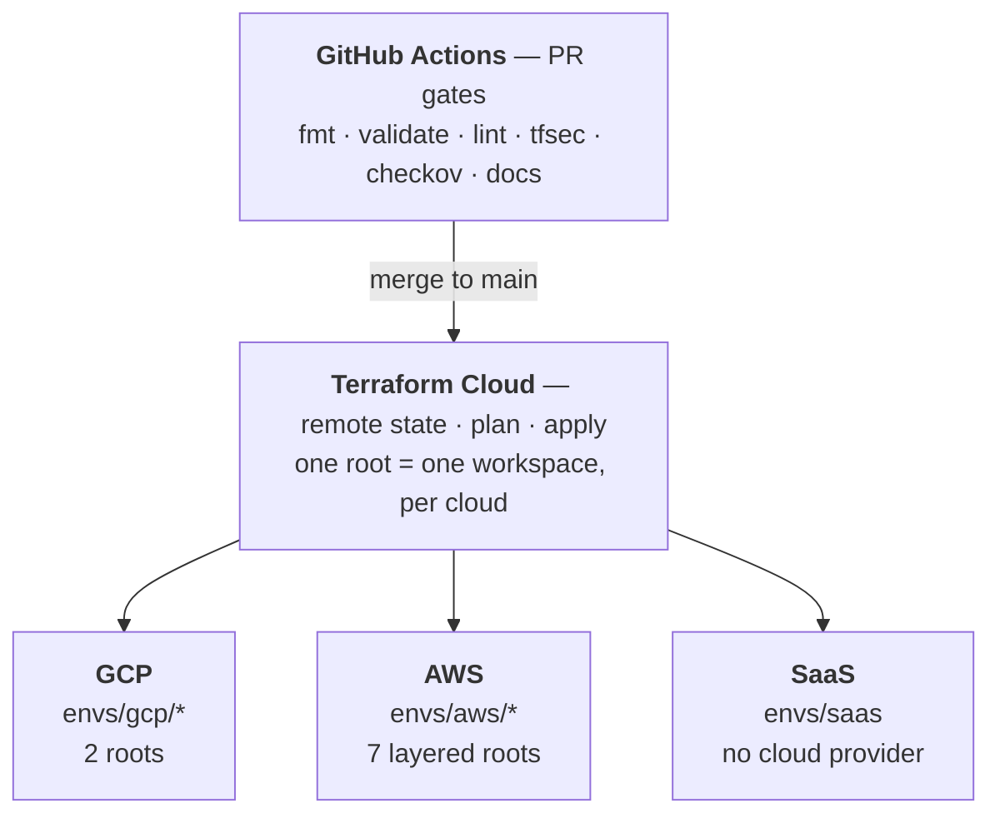

<div align="center">


# Ashes DevOps Tools

**Production-grade Terraform infrastructure for AWS, GCP, Supabase, and Vercel**

[](https://terraform.io)
[](https://aws.amazon.com)
[](https://cloud.google.com)
[](https://supabase.com)
[](https://vercel.com)
[](https://opensource.org/licenses/MIT)

<br/>

[](https://github.com/EdwinKassier/Ashes-Devops-Tools/actions/workflows/terraform-plan.yml)
[](https://github.com/EdwinKassier/Ashes-Devops-Tools/actions/workflows/security-scan.yml)
[](https://pre-commit.com)
[](modules/)
[](modules/)

<sub>Modules/test-suite counts above are hand-maintained, not live badges. Verify: <code>find modules -name main.tf -not -path '*/examples/*' -not -path '*/.terraform/*' | wc -l</code> (modules) and <code>find modules envs -name '*.tftest.hcl' -not -path '*/.terraform/*' | wc -l</code> (test suites). Last verified 2026-08-24: 98 modules, 180 test suites.</sub>

</div>

---

## Overview

**Ashes DevOps Tools** is a fully-tested, security-scanned Terraform platform covering the four clouds it supports — `{aws, gcp, supabase, vercel}`. Each cloud is its own root(s) and Terraform Cloud workspace(s), so you deploy **any combination**:

| Cloud | Roots | What it manages |
|:--------|:--------|:----------------|
| **GCP** | `gcp-organization` + `gcp-workload` | Landing zone (org hierarchy, IAM, networking hub, VPC-SC, KMS, audit logs) plus per-env application environments (host projects, Shared VPC, Cloud Armor, VPN, Interconnect) |
| **AWS** | `aws-*` (7 layered roots) | Multi-account SRA org + guardrails (SCP/RCP/declarative), security baseline (GuardDuty/Security Hub/Config/CloudTrail/Access Analyzer/Security Lake), Transit Gateway network, IAM Identity Center, org backup, cost governance |
| **Supabase** | `saas` (`enable_supabase`) | Projects + vault secrets, three-tier environments |
| **Vercel** | `saas` (`enable_vercel`) | Projects, three-tier environments |

**Execution model:** Terraform Cloud owns all live state and applies. GitHub Actions validates every PR. Tags trigger release metadata — never direct applies.

---

## Quick Start

```bash
# 1. Clone and install repo tooling
git clone https://github.com/EdwinKassier/Ashes-Devops-Tools.git
cd Ashes-Devops-Tools
make install && make pre-commit-install

# 2. Authenticate (only the clouds whose workspaces you apply)
gcloud auth application-default login     # GCP roots (gcp-organization, gcp-workload)
export SUPABASE_ACCESS_TOKEN="sbp_..."   # required for supabase modules
export VERCEL_API_TOKEN="..."            # required for vercel modules
# AWS roots use TFC dynamic credentials (TFC_AWS_PROVIDER_AUTH + TFC_AWS_RUN_ROLE_ARN)
# or AWS_PROFILE for local runs — see the AWS Bootstrap runbook for the full flow.

# 3. Run the local validation suite (no cloud credentials needed for tests)
make ci
```

> Full bootstrap sequence, backend config, and first apply: **[Quick Start Guide →](docs/guides/QUICK_START.md)**

---

## Architecture



Both clouds are full landing zones; the difference is only how the same responsibilities are packaged into roots — GCP folds into **two** what the AWS SRA spreads across **seven**. This table aligns them layer-for-layer:

| Responsibility band | GCP root | AWS root |
|:--------------------|:---------|:---------|
| Org structure, guardrails, foundation identity (WIF), org CMEK | `gcp-organization` *(bootstrap + organization stages)* | `aws-organization` |
| Security & threat-detection baseline | *folded into* `gcp-organization` *(SCC, audit logs)* | `aws-security` |
| Network hub (shared/transit backbone + DNS) | *folded into* `gcp-organization` *(network-hub stage)* | `aws-network` |
| Human SSO / access management | *folded into* `gcp-organization` *(Cloud Identity groups)* | `aws-identity` |
| Shared platform services | *folded into* `gcp-organization` *(projects stage)* | `aws-shared-services` |
| Centralized backup | *native GCS lifecycle / snapshots — no dedicated root* | `aws-backup` |
| Per-environment workload | `gcp-workload-<env>` | `aws-workload-<env>` |
| SaaS (Supabase / Vercel) | `saas-<name>` *(cloud-agnostic — no cloud provider)* | `saas-<name>` *(same root)* |

> Ordering is enforced by apply order + remote-state reads, not cross-root `depends_on`. Deploy any subset — a cloud you don't apply pulls in no credentials.
>
> Each cloud is a full landing zone with its own layered roots, documented to the same structure so you can compare them control-for-control: **[GCP Landing Zone →](docs/architecture/gcp-landing-zone.md)** · **[AWS Landing Zone →](docs/architecture/aws-landing-zone.md)**. Cloud selection is which workspaces you apply, not a runtime flag: **[Provider Selection →](docs/architecture/provider-selection.md)**.

### Choosing providers

Deploy **any combination** of `{aws, gcp, supabase, vercel}`. Each cloud lives in its own root (and TFC workspace), so an unused cloud's provider is physically absent from what you apply — a `provider` block can't be conditional, and Terraform authenticates any referenced provider even at `count = 0`. **Cloud selection is therefore which workspaces you apply, not a runtime `enable_<cloud>` flag** (`enable_*` only gates features within a root). Every subset — including AWS-only, GCP-only, or SaaS-only — is just the union of the per-cloud workspaces and their credentials.

> Full rationale, root inventory, minimum AWS footprint, and the any-combination matrix: **[Provider Selection →](docs/architecture/provider-selection.md)**

---

## Module Library

98 modules — **46 GCP · 46 AWS · 6 SaaS** — each with auto-generated docs and `mock_provider` tests.

Both clouds are organized into the **same conceptual domains** so you can map a capability across providers at a glance. Each table reads: **capability → Google Cloud module → Amazon Web Services module**. A `—` means the platform has no dedicated module for that capability (often because it is native, or lives in an adjacent domain — noted inline). Link text is the module's path under `modules/<cloud>/`.

### SaaS Integrations

| Module | Provider | Purpose |
|:-------|:---------|:--------|
| [`supabase/project`](modules/supabase/project/) | Supabase | Project provisioning with lifecycle guard |
| [`supabase/settings`](modules/supabase/settings/) | Supabase | Auth + API settings management |
| [`supabase/environment`](modules/supabase/environment/) | Supabase | Composite: project + settings + API keys |
| [`supabase/vault-secrets`](modules/supabase/vault-secrets/) | Supabase + Node.js | Vault bootstrap and secret reconciliation |
| [`vercel/project`](modules/vercel/project/) | Vercel | Three-environment project with drift resistance |
| [`saas/stages/saas-workload`](modules/saas/stages/saas-workload/) | All three | Full SaaS environment in one call |

### Cloud modules by domain

<details>
<summary><strong>Networking</strong> — GCP 19 · AWS 10</summary>

Both clouds build a hub-and-spoke private network from the same primitives; the names differ, the roles line up.

| Capability | Google Cloud | Amazon Web Services |
|:-----------|:-------------|:--------------------|
| Core private network | [`network/vpc`](modules/gcp/network/vpc/), [`network/subnet`](modules/gcp/network/subnet/) | [`network/vpc`](modules/aws/network/vpc/) |
| IP address management | *(manual CIDR planning)* | [`network/ipam`](modules/aws/network/ipam/) |
| Hub interconnect / transit | [`network/shared-vpc-service`](modules/gcp/network/shared-vpc-service/), [`network/vpc-peering`](modules/gcp/network/vpc-peering/), [`network/interconnect`](modules/gcp/network/interconnect/) | [`network/transit-gateway`](modules/aws/network/transit-gateway/) |
| Private service access | [`network/private-service-connect`](modules/gcp/network/private-service-connect/), [`network/private-service-access`](modules/gcp/network/private-service-access/) | [`network/vpc-endpoints`](modules/aws/network/vpc-endpoints/) |
| DNS | [`network/dns`](modules/gcp/network/dns/) | [`network/route53-resolver`](modules/aws/network/route53-resolver/) |
| Hybrid VPN | [`network/vpn`](modules/gcp/network/vpn/) (HA-VPN) | [`network/vpn`](modules/aws/network/vpn/) (Site-to-Site) |
| Egress NAT | [`network/nat`](modules/gcp/network/nat/) | *(native, in `network/vpc`)* |
| Load balancing | [`network/internal-lb`](modules/gcp/network/internal-lb/) | [`network/load-balancer`](modules/aws/network/load-balancer/) (ALB/NLB) |
| Content delivery / CDN | [`network/cdn`](modules/gcp/network/cdn/) | [`security/edge-security`](modules/aws/security/edge-security/) (CloudFront + WAF/Shield) |
| API gateway / edge | [`network/api-gateway`](modules/gcp/network/api-gateway/) | [`network/api-gateway`](modules/aws/network/api-gateway/) |
| Stateful firewall | [`network/network-firewall`](modules/gcp/network/network-firewall/), [`network/hierarchical-firewall`](modules/gcp/network/hierarchical-firewall/) | [`network/network-firewall`](modules/aws/network/network-firewall/) |
| Web app firewall / DDoS | [`network/cloud-armor`](modules/gcp/network/cloud-armor/) | *(Security → `edge-security`, `firewall-manager-org`)* |
| Traffic mirroring / analysis | [`network/packet-mirroring`](modules/gcp/network/packet-mirroring/) | [`network/network-access-analyzer`](modules/aws/network/network-access-analyzer/) |
| Flow logging | [`network/vpc-flow-logs`](modules/gcp/network/vpc-flow-logs/) | *(native VPC flow logs)* |
| Service perimeter | [`network/vpc-sc`](modules/gcp/network/vpc-sc/) | *(Governance → `organization-policy` SCP/RCP)* |

</details>

<details>
<summary><strong>IAM &amp; Identity</strong> — GCP 7 · AWS 2</summary>

| Capability | Google Cloud | Amazon Web Services |
|:-----------|:-------------|:--------------------|
| Workforce identity / SSO | [`iam/identity-group`](modules/gcp/iam/identity-group/), [`iam/identity-group-memberships`](modules/gcp/iam/identity-group-memberships/) | [`iam/iam-identity-center`](modules/aws/iam/iam-identity-center/) |
| Roles &amp; permissions | [`iam/organization`](modules/gcp/iam/organization/), [`iam/role`](modules/gcp/iam/role/) | [`iam/iam-role`](modules/aws/iam/iam-role/) |
| Deny-policy guardrails | [`iam/deny-policy`](modules/gcp/iam/deny-policy/) | *(SCP/RCP — see Governance)* |
| Service / machine identity | [`iam/service-account`](modules/gcp/iam/service-account/) | *(IAM roles + instance profiles)* |
| Federated workload identity | [`iam/workload-identity`](modules/gcp/iam/workload-identity/) | *(OIDC via `iam/iam-role`)* |

</details>

<details>
<summary><strong>Security &amp; Threat Detection</strong> — GCP 2 · AWS 13</summary>

GCP consolidates detection into Security Command Center plus audit logs; the AWS SRA breaks the same surface into many org-wide, delegated-admin services — hence the count asymmetry.

| Capability | Google Cloud | Amazon Web Services |
|:-----------|:-------------|:--------------------|
| Posture / findings management | [`governance/scc`](modules/gcp/governance/scc/) | [`security/securityhub-org`](modules/aws/security/securityhub-org/) |
| Threat detection | *(SCC / Event Threat Detection)* | [`security/guardduty-org`](modules/aws/security/guardduty-org/) |
| Audit &amp; activity logging | [`governance/cloud-audit-logs`](modules/gcp/governance/cloud-audit-logs/) | [`security/cloudtrail-org`](modules/aws/security/cloudtrail-org/) |
| Config &amp; compliance recording | *(SCC posture)* | [`security/config-org`](modules/aws/security/config-org/) |
| Security data lake | — | [`security/securitylake`](modules/aws/security/securitylake/) |
| Delegated security administration | — | [`security/security-delegated-admin`](modules/aws/security/security-delegated-admin/), [`security/org-security-service`](modules/aws/security/org-security-service/) |
| IAM access analysis | *(IAM Recommender / Policy Analyzer)* | [`security/access-analyzer-org`](modules/aws/security/access-analyzer-org/) |
| Edge / WAF management | *(Networking → `cloud-armor`)* | [`security/edge-security`](modules/aws/security/edge-security/), [`security/firewall-manager-org`](modules/aws/security/firewall-manager-org/) |
| Secrets baseline | *(SaaS → `supabase/vault-secrets`)* | [`security/secrets-baseline`](modules/aws/security/secrets-baseline/) |
| Incident response | — | [`security/incident-response`](modules/aws/security/incident-response/) |
| Finding notifications | *(Observability → `alert-policy`)* | [`security/security-notifications`](modules/aws/security/security-notifications/) |

</details>

<details>
<summary><strong>Governance &amp; Org Management</strong> — GCP 3 · AWS 7</summary>

| Capability | Google Cloud | Amazon Web Services |
|:-----------|:-------------|:--------------------|
| Org / account structure | *(folders via `stages/organization`)* | [`governance/organization`](modules/aws/governance/organization/), [`governance/account`](modules/aws/governance/account/) |
| Policy guardrails | [`governance/org-policy`](modules/gcp/governance/org-policy/) | [`governance/organization-policy`](modules/aws/governance/organization-policy/) |
| Account / project baseline | *(via `stages/projects`)* | [`governance/account-baseline`](modules/aws/governance/account-baseline/) |
| Cost &amp; budgets | [`governance/billing`](modules/gcp/governance/billing/) | [`governance/cost-governance`](modules/aws/governance/cost-governance/) |
| Resource tagging | [`governance/tags`](modules/gcp/governance/tags/) | *(tag policies via `governance/organization-policy`)* |
| Service quotas | — | [`governance/service-quotas`](modules/aws/governance/service-quotas/) |
| Org-wide IAM features | *(via `iam/organization`)* | [`governance/iam-organizations-features`](modules/aws/governance/iam-organizations-features/) |

</details>

<details>
<summary><strong>Data, Storage &amp; Encryption</strong> — GCP 4 · AWS 4</summary>

| Capability | Google Cloud | Amazon Web Services |
|:-----------|:-------------|:--------------------|
| Object storage / log archive | [`cloud-storage`](modules/gcp/cloud-storage/) | [`data/log-archive-bucket`](modules/aws/data/log-archive-bucket/) |
| Artifact / image registry | [`artifact-registry`](modules/gcp/artifact-registry/) | [`data/ecr`](modules/aws/data/ecr/) |
| Encryption keys (CMEK / KMS) | [`governance/kms`](modules/gcp/governance/kms/) | [`data/kms-key`](modules/aws/data/kms-key/) |
| Private certificate authority | [`governance/private-ca`](modules/gcp/governance/private-ca/) (CAS) | [`data/private-ca`](modules/aws/data/private-ca/) |

</details>

<details>
<summary><strong>Backup &amp; Resilience</strong> — GCP 1 · AWS 2</summary>

| Capability | Google Cloud | Amazon Web Services |
|:-----------|:-------------|:--------------------|
| Scheduled backups / snapshots | [`backup/backup-plan`](modules/gcp/backup/backup-plan/) (snapshot schedules + retention) | [`backup/backup-vault`](modules/aws/backup/backup-vault/) |
| Org-wide backup policy | *(per-project resource policies)* | [`backup/backup-org-policy`](modules/aws/backup/backup-org-policy/) |

</details>

<details>
<summary><strong>Observability &amp; Operations</strong> — GCP 3 · AWS 2</summary>

| Capability | Google Cloud | Amazon Web Services |
|:-----------|:-------------|:--------------------|
| Metrics &amp; alerting | [`monitoring/alert-policy`](modules/gcp/monitoring/alert-policy/) | [`ops/cloudwatch`](modules/aws/ops/cloudwatch/) (metric alarms + SNS) |
| Dashboards | [`monitoring/compute-dashboard`](modules/gcp/monitoring/compute-dashboard/) | [`ops/cloudwatch`](modules/aws/ops/cloudwatch/) (dashboard) |
| Fleet / patch management | [`ops/os-config`](modules/gcp/ops/os-config/) (VM Manager) | [`ops/systems-manager`](modules/aws/ops/systems-manager/) |

</details>

<details>
<summary><strong>Application Platform</strong> — GCP 1 · AWS 0</summary>

| Capability | Google Cloud | Amazon Web Services |
|:-----------|:-------------|:--------------------|
| App / mobile backend | [`firebase/project`](modules/gcp/firebase/project/) | *(Amplify / App Runner — no module)* |

</details>

<details>
<summary><strong>Orchestration Stages</strong> — GCP 6 · AWS 6</summary>

Composite stages wrap the primitives above into deployable landing-zone layers, one per root/workspace. Layers line up across clouds even where a cloud folds two responsibilities into one stage.

| Layer | Google Cloud | Amazon Web Services |
|:------|:-------------|:--------------------|
| Bootstrap / foundation | [`stages/bootstrap`](modules/gcp/stages/bootstrap/) | *(phase-0, out-of-band — see aws-bootstrap runbook)* |
| Organization &amp; guardrails | [`stages/organization`](modules/gcp/stages/organization/) | [`stages/organization`](modules/aws/stages/organization/) |
| Security baseline | *(folded into `stages/organization`)* | [`stages/security`](modules/aws/stages/security/) |
| Projects / accounts | [`stages/projects`](modules/gcp/stages/projects/) | *(accounts via `stages/organization`)* |
| Network hub | [`stages/network-hub`](modules/gcp/stages/network-hub/) | [`stages/network-hub`](modules/aws/stages/network-hub/) |
| Shared services | *(via `stages/projects`)* | [`stages/shared-services`](modules/aws/stages/shared-services/) |
| Backup | — | [`stages/backup`](modules/aws/stages/backup/) |
| Workload (per environment) | [`stages/workload`](modules/gcp/stages/workload/), [`stages/host`](modules/gcp/stages/host/) | [`stages/workload`](modules/aws/stages/workload/) |

</details>

---

## Commands

```bash
make ci                    # Full local pipeline (fmt + docs + validate + lint + security + test)
make fmt                   # Format all Terraform files
make test                  # Run all 153 .tftest.hcl suites (no cloud creds needed)
make validate-all          # terraform validate across all roots
make lint                  # TFLint with GCP ruleset
make security              # tfsec + Checkov
make docs                  # Regenerate all module READMEs via terraform-docs
make docs-check            # Verify no README is stale
make plan-gcp-organization     # Plan control-plane changes
make plan-gcp-workload APP_ENV=dev APP_VARS=examples/dev.tfvars
```

---

## CI / CD

| Workflow | Trigger | What it does |
|:---------|:--------|:-------------|
| [`terraform-plan.yml`](.github/workflows/terraform-plan.yml) | Pull Request | fmt · docs-check · validate · lint · tfsec · checkov |
| [`terraform-apply.yml`](.github/workflows/terraform-apply.yml) | Tags (`gcp-organization/v*`, `gcp-workload/*/v*`) | Verify TFC run → publish GitHub release |
| [`security-scan.yml`](.github/workflows/security-scan.yml) | Push + weekly | tfsec · checkov · Trivy · Gitleaks → SARIF |
| [`documentation.yml`](.github/workflows/documentation.yml) | Module `*.tf` changes | Auto-generate docs → open PR |
| [`drift-detection.yml`](.github/workflows/drift-detection.yml) | Scheduled | Detect infrastructure drift |

**Releasing:**

```bash
git tag -a gcp-organization/v1.2.0 -m "Release organization v1.2.0"
git push origin gcp-organization/v1.2.0
```

---

## Documentation

| Document | Description |
|:---------|:------------|
| [Documentation Index](docs/INDEX.md) | Complete navigation hub |
| [Quick Start](docs/guides/QUICK_START.md) | Bootstrap, creds, first apply |
| [Architecture](docs/architecture/ARCHITECTURE.md) | Roots, modules, execution model |
| [GCP Landing Zone](docs/architecture/gcp-landing-zone.md) | Folder/project model, two-root layer map, Shared VPC hub-spoke, foundation conformance checklist |
| [AWS Landing Zone](docs/architecture/aws-landing-zone.md) | Multi-account SRA model, layer map, SRA conformance checklist |
| [Cross-Cloud Comparison](docs/architecture/cross-cloud-comparison.md) | Where each capability lives per provider, side by side |
| [Landing-Zone Conformance](docs/architecture/landing-zone-conformance.md) | 2026 best-practice adherence review + gap register, both clouds |
| [Adding a Cloud](docs/architecture/adding-a-cloud.md) | Per-cloud-root contract for extending the platform |
| [Provider Selection](docs/architecture/provider-selection.md) | Any-combination cloud matrix, per-cloud-root model |
| [Network Topology](docs/architecture/network-topology.md) | Hub-spoke layout, VPC-SC, WIF flows |
| [Troubleshooting](docs/guides/TROUBLESHOOTING.md) | Common errors including Supabase/Vercel |
| [Branch Protection](docs/guides/BRANCH_PROTECTION.md) | GitHub ruleset configuration |
| [CLAUDE.md](CLAUDE.md) | Onboarding guide for AI agents |
| [CONTRIBUTING.md](CONTRIBUTING.md) | Development workflow and standards |
| [CHANGELOG.md](CHANGELOG.md) | Release notes |

**Runbook parity** — the same operational scenarios exist for both clouds, so an operator fluent in one can follow the other:

| Scenario | Google Cloud | Amazon Web Services |
|:---------|:-------------|:--------------------|
| First-time stand-up | [Bootstrap](docs/runbooks/bootstrap.md) | [AWS Bootstrap](docs/runbooks/aws-bootstrap.md) |
| Add a deployable unit | [Add Environment](docs/runbooks/add-environment.md) | [AWS Add Account](docs/runbooks/aws-add-account.md) |
| Onboard a service team | [Service Team Onboarding](docs/runbooks/service-team-onboarding.md) | *(via Add Account)* |
| Break-glass access | [Break Glass](docs/runbooks/break-glass.md) | [AWS Break Glass](docs/runbooks/aws-break-glass.md) |
| Incident response | [Incident Response](docs/runbooks/incident-response.md) | [AWS Incident Response](docs/runbooks/aws-incident-response.md) |
| KMS key rotation | [KMS Rotation](docs/runbooks/kms-rotation.md) | [AWS KMS Rotation](docs/runbooks/aws-kms-rotation.md) |
| CIDR expansion | [CIDR Expansion](docs/runbooks/cidr-expansion.md) | [AWS CIDR Expansion](docs/runbooks/aws-cidr-expansion.md) |
| Teardown | [Teardown](docs/runbooks/teardown.md) | [AWS Teardown](docs/runbooks/aws-teardown.md) |

---

## Security

> Report vulnerabilities via [SECURITY.md](SECURITY.md) — do not open a public issue.

- **PR gates:** TFSec + Checkov on every pull request
- **Scheduled scans:** Trivy (container/IaC) + Gitleaks (secrets) weekly
- **SARIF upload:** All findings surface in the GitHub Security tab
- **Inline skips only:** False positives are suppressed with `# tfsec:ignore` / `# checkov:skip` on the specific resource — never via global skip lists

---

<div align="center">

Built with [Terraform](https://terraform.io) · [AWS](https://aws.amazon.com) · [Google Cloud](https://cloud.google.com) · [Supabase](https://supabase.com) · [Vercel](https://vercel.com)

</div>
