# System Architecture

## Overview

The Ashes DevOps Tools repository implements a multi-environment, modular infrastructure as code solution for Google Cloud Platform using Terraform.

---

## Architecture Principles

### 1. **Modularity**
- Reusable, composable infrastructure modules
- Single responsibility per module
- Clean separation of concerns
- DRY (Don't Repeat Yourself) principle

### 2. **Multi-Environment Support**
- Separate configurations for dev, UAT, and production
- Environment-specific variables and settings
- Consistent structure across environments
- Isolated state management

### 3. **Security First**
- Private by default
- Least privilege IAM
- Encryption at rest and in transit
- Automated security scanning
- Audit logging enabled

### 4. **Automation**
- CI/CD pipelines for validation and deployment
- Automated documentation generation
- Pre-commit hooks for code quality
- Scheduled security scans

### 5. **Compliance**
- ISO 27001 alignment
- ISO 22301 alignment
- GCP best practices
- Infrastructure as Code standards

---

## Repository Structure

```
Ashes-Devops-Tools/
├── envs/                        # Environment configurations
│   ├── organisation/            # Organization-level resources
│   ├── dev/                     # Development environment
│   ├── uat/                     # User Acceptance Testing
│   └── prod/                    # Production environment
├── modules/                     # Reusable Terraform modules
│   ├── artifact_registery/      # Container registry
│   ├── cloud_functions/         # Serverless functions
│   ├── cloud_run/               # Containerized applications
│   ├── cloud_storage/           # Object storage
│   ├── firebase/                # Firebase services
│   ├── governance/              # Billing, audit logs
│   ├── host/                    # Unified project orchestration
│   ├── iam/                     # Identity and access management
│   └── network/                 # Networking components
├── docs/                        # Documentation
├── scripts/                     # Utility scripts
└── .github/                     # CI/CD workflows
```

---

## Module Architecture

### Module Categories

#### **Compute & Applications**
- `cloud_run/` - Managed containerized applications
- `cloud_functions/` - Event-driven serverless functions
- `firebase/` - Application platform

#### **Storage & Data**
- `cloud_storage/` - Object storage buckets
- `artifact_registery/` - Container images

#### **Networking**
- `vpc/` - Virtual Private Cloud
- `network-firewall/` - Firewall rules
- `cloud_armor/` - DDoS protection
- `api_gateway/` - API management

#### **IAM & Security**
- `iam/organisation/` - Organization IAM
- `iam/role/` - Custom IAM roles
- `identity_group/` - Group management
- `governance/cloud-audit-logs/` - Audit logging

#### **Governance**
- `governance/billing/` - Budget alerts
- `governance/cloud-audit-logs/` - Compliance logging

#### **Orchestration**
- `host/` - Unified project provisioning

### Module Design Pattern

Each module follows a consistent structure:

```
module-name/
├── main.tf          # Resource definitions
├── variables.tf     # Input variables
├── outputs.tf       # Output values
├── versions.tf      # Provider versions
├── README.md        # Documentation (auto-generated)
└── examples/        # Usage examples (optional)
```

---

## Environment Architecture

### Organization Level

```
Organization
├── Organizational Units
│   ├── Development
│   ├── UAT
│   └── Production
├── IAM Policies
├── Organization Policies
└── Audit Logs
```

### Project Structure

Each environment contains:

```
Environment (dev/uat/prod)
├── Shared Services Project
│   ├── Networking (VPC, subnets, firewall)
│   ├── Security (KMS, Secret Manager)
│   ├── Monitoring (Cloud Logging, Monitoring)
│   └── Governance (Audit logs, budgets)
└── Applications Project
    ├── Compute (Cloud Run, Cloud Functions)
    ├── Storage (Cloud Storage, Firestore)
    ├── Networking (Load Balancers, CDN)
    └── IAM (Service accounts, roles)
```

---

## Network Architecture

### VPC Design

```
VPC Network
├── Public Subnets (3 zones)
│   └── Internet-facing services
├── Private Subnets (3 zones)
│   └── Internal services
├── Database Subnets (3 zones)
│   └── Data storage
├── Cloud Router
│   └── NAT Gateway
└── Firewall Rules
    ├── Ingress rules
    └── Egress rules
```

### Network Security Layers

1. **Perimeter Security**
   - Cloud Armor (DDoS protection)
   - WAF rules
   - Rate limiting

2. **Network Security**
   - VPC firewall rules
   - Private Google Access
   - VPC Service Controls

3. **Application Security**
   - IAM authentication
   - Service-to-service auth
   - Private endpoints

---

## Security Architecture

### Defense in Depth

```
┌─────────────────────────────────────────┐
│           Cloud Armor (L7)              │ ← DDoS, WAF
├─────────────────────────────────────────┤
│       Load Balancer (L4/L7)             │ ← SSL/TLS termination
├─────────────────────────────────────────┤
│          VPC Firewall Rules             │ ← Network filtering
├─────────────────────────────────────────┤
│         IAM & Service Accounts          │ ← Identity & authorization
├─────────────────────────────────────────┤
│      Application-level Security         │ ← App authentication
├─────────────────────────────────────────┤
│      Data Encryption (at rest)          │ ← KMS encryption
└─────────────────────────────────────────┘
```

### Security Controls

| Layer | Control | Implementation |
|:---|:---|:---|
| **Network** | Firewall | VPC firewall rules |
| **Network** | Private Access | Private Google Access |
| **Network** | DDoS Protection | Cloud Armor |
| **Identity** | IAM | Service accounts, roles |
| **Identity** | MFA | Enforced for admin access |
| **Data** | Encryption at Rest | KMS, CMEK |
| **Data** | Encryption in Transit | TLS 1.2+ |
| **Monitoring** | Audit Logs | All API calls logged |
| **Monitoring** | Security Scanning | TFSec, Checkov, Trivy |

---

## CI/CD Architecture

### Pipeline Flow

```mermaid
graph LR
    A[Developer] -->|Push| B[Git Repository]
    B -->|Trigger| C[GitHub Actions]
    C -->|Validate| D[Terraform Plan]
    D -->|Security Scan| E[TFSec/Checkov]
    E -->|Pass| F[Code Review]
    F -->|Approve| G[Tag Release]
    G -->|Deploy| H[Terraform Apply]
    H -->|Verify| I[Health Checks]
```



### Workflow Stages

1. **Code Quality** (PR)
   - Format check
   - Validation
   - Linting
   - Security scanning

2. **Review** (PR)
   - Manual code review
   - Automated checks pass
   - Documentation updated

3. **Deployment** (Tag)
   - Tag-based deployment
   - Environment-specific
   - Approval required (prod)
   - Health verification

---

## Disaster Recovery

### Recovery Objectives

| Metric | Target | Notes |
|:---|:---:|:---|
| **RTO** (Recovery Time Objective) | < 4 hours | Time to restore services |
| **RPO** (Recovery Point Objective) | < 1 hour | Maximum data loss |
| **MTTR** (Mean Time To Recover) | < 2 hours | Average recovery time |

### Backup Strategy

1. **Infrastructure as Code**
   - Complete infrastructure defined in Git
   - Version controlled
   - Can rebuild from scratch

2. **State Management**
   - Remote state in GCS
   - State versioning enabled
   - State backups automated

3. **Data Backups**
   - Cloud Storage versioning
   - Firestore backups
   - Database snapshots

### Recovery Procedures

1. **Complete Disaster** (region loss)
   ```bash
   # Deploy to alternate region
   cd envs/prod
   terraform init
   terraform plan -var="region=us-central1"
   terraform apply
   ```

2. **Partial Failure** (service down)
   ```bash
   # Recreate specific resource
   terraform taint module.cloud_run.service["app"]
   terraform apply
   ```

3. **Configuration Error**
   ```bash
   # Rollback to previous version
   git revert <commit-hash>
   terraform apply
   ```

---

## Scalability

### Horizontal Scaling

- **Cloud Run**: Auto-scales based on requests
- **Cloud Functions**: Auto-scales based on events
- **Load Balancers**: Auto-scales capacity

### Vertical Scaling

- **Resource Limits**: Configurable via variables
- **Machine Types**: Defined per service
- **Disk Size**: Expandable without downtime

### Performance Optimization

1. **CDN**: Cloud CDN for static content
2. **Caching**: Memorystore for caching
3. **Connection Pooling**: For database connections
4. **Async Processing**: Cloud Functions for background tasks

---

## Monitoring & Observability

### Metrics Collection

- **Cloud Monitoring**: System metrics
- **Custom Metrics**: Application metrics
- **Audit Logs**: Security events
- **Performance**: Latency, throughput

### Alerting

- **Budget Alerts**: Cost overruns
- **Error Rate Alerts**: Application errors
- **Latency Alerts**: Performance degradation
- **Security Alerts**: Unauthorized access

### Logging

- **Application Logs**: Structured JSON logs
- **Audit Logs**: Compliance tracking
- **System Logs**: Infrastructure events
- **Access Logs**: Authentication attempts

---

## Cost Optimization

### Strategies

1. **Right-Sizing**
   - Monitor resource utilization
   - Adjust limits based on actual usage
   - Use preemptible instances where appropriate

2. **Auto-Scaling**
   - Scale down during low traffic
   - Scale to zero for unused services
   - Scheduled scaling

3. **Committed Use Discounts**
   - 1-year or 3-year commitments
   - Sustained use discounts
   - Custom machine types

4. **Budget Controls**
   - Budget alerts configured
   - Cost allocation labels
   - Regular cost reviews

---

## Compliance & Governance

### ISO 27001 Controls

- Risk assessment procedures
- Access control policies
- Incident management
- Business continuity planning
- Supplier management
- Asset management

### ISO 22301 Controls

- Business impact analysis
- Recovery strategies
- Testing procedures
- Continuous improvement

### GCP Best Practices

- Organization policies
- Resource hierarchy
- IAM least privilege
- Audit logging
- Encryption standards

---

## Technology Stack

| Component | Technology | Version |
|:---|:---|:---:|
| **IaC** | Terraform | >= 1.0.0 |
| **Provider** | Google Cloud | ~> 4.80 |
| **CI/CD** | GitHub Actions | Latest |
| **Security** | TFSec, Checkov, Trivy | Latest |
| **Documentation** | terraform-docs | Latest |
| **Linting** | TFLint | Latest |

---

## Future Enhancements

### Planned Improvements

1. **Testing**
   - Terratest integration tests
   - Policy-as-code tests
   - Performance testing

2. **Monitoring**
   - SLO/SLI definitions
   - Custom dashboards
   - Advanced alerting

3. **Cost**
   - Infracost integration
   - Cost attribution
   - Optimization recommendations

4. **Security**
   - Runtime security scanning
   - Automated remediation
   - Threat detection

---

**Last Updated**: October 2024
**Version**: 1.0.0

