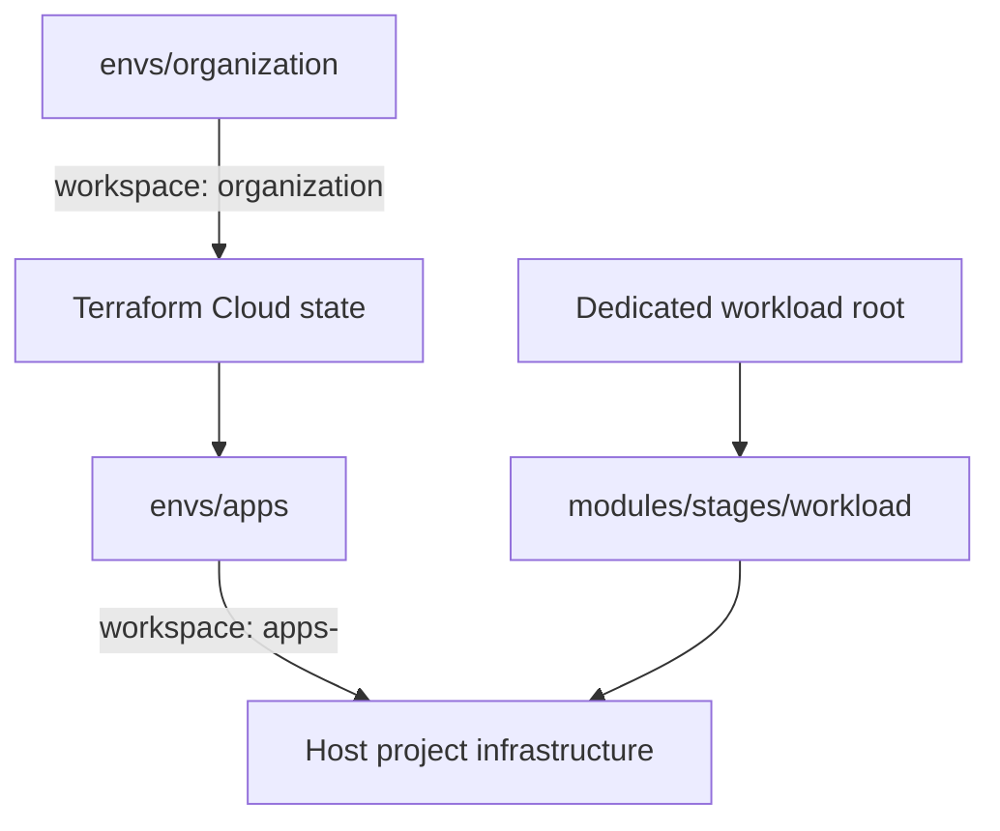

# System Architecture

## Overview

This repository implements a GCP landing zone with two supported Terraform roots:

- `envs/organization` for the control plane
- `envs/apps` for environment-specific application infrastructure

The design target is a low-touch platform that is easy to extend without copying roots or editing workflow matrices.

## Supported Roots

```text
envs/
├── organization/
└── apps/
```

### `envs/organization`

Creates and manages:

- admin project
- Terraform admin service account
- workload identity providers
- folders and folder IAM
- shared projects
- per-environment host projects
- org policy
- tags
- centralized audit logging
- SCC notifications
- billing export and budgets
- hub networking

This root composes four stage modules:

- `modules/stages/bootstrap`
- `modules/stages/organization`
- `modules/stages/projects`
- `modules/stages/network-hub`

### `envs/apps`

Consumes remote state from the `organization` workspace and deploys one environment at a time into the selected host project.

The workspace naming contract is:

- `organization`
- `apps-dev`
- `apps-uat`
- `apps-prod`
- `apps-<env>` for any new environment

## Environment Model

The canonical environment contract lives in `envs/organization/variables.tf`:

```hcl
map(object({
  display_name            = string
  region                  = string
  cidr_block              = string
  budget_monthly_limit    = number
  iam_group_role_bindings = map(set(string))
  labels                  = optional(map(string), {})
}))
```

That keeps CIDRs explicit and stable. The old pattern of deriving CIDRs from key ordering is no longer part of the platform.

## Module Layering

### Stage Modules

- `modules/stages/bootstrap`
  - admin project
  - Terraform admin service account
  - GitHub and Terraform Cloud workload identity

- `modules/stages/organization`
  - folders
  - tags
  - org policy
  - audit logging
  - SCC notifications
  - billing export and budget alerts — optional email notifications are delivered via a **Cloud Functions gen2** function backed by Cloud Run v2; set `vpc_connector` when the `cloudfunctions.requireVPCConnector` org policy is enforced

- `modules/stages/projects`
  - shared platform projects
  - one host project per declared environment

- `modules/stages/network-hub`
  - shared hub VPC
  - shared DNS
  - hierarchical firewall
  - organization-spanning connectivity
  - VPC Service Controls perimeter — `spoke_project_numbers` must contain **numeric project numbers** (e.g. `"123456789012"`), not project ID strings; the Access Context Manager API rejects project ID strings with a misleading permission error

- `modules/stages/workload`
  - separate service projects that attach to a Shared VPC host

- `modules/stages/saas-workload`
  - Supabase project, settings, and API keys (via `supabase/environment`)
  - Supabase Vault secret reconciliation — Node.js provisioner, UPPER_SNAKE_CASE namespace, safety guard (via `supabase/vault-secrets`, gated by `enable_vault_secrets`)
  - Vercel project with QA/preview, UAT/custom, and production three-tier environments (via `vercel/project`, gated by `enable_vercel`)
  - Designed for phased deployment: apply Supabase first, then opt in to vault-secrets and Vercel separately

### Shared Infrastructure Modules

- `modules/network/*` contains the reusable network primitives
- `modules/governance/*` contains budgets, logging, KMS, org policy, SCC, and tags
- `modules/iam/*` contains reusable IAM primitives
- `modules/host` remains the compatibility wrapper used by `envs/apps`

### SaaS Modules

- `modules/supabase/*` contains Supabase primitives consumed by the `saas-workload` stage:
  - `project` — creates a `supabase_project`; lifecycle guard ignores `database_password` after initial creation (Management API limitation)
  - `settings` — manages auth and API settings on an existing project via `supabase_settings`; destroying this resource is a no-op by provider design (settings revert to Supabase defaults)
  - `environment` — composite module: project + settings + `data.supabase_apikeys`; primary building block for per-environment deployments
  - `vault-secrets` — bootstraps the Supabase Vault with `SECURITY DEFINER` helper functions and reconciles a desired-state `map(string)` of secrets; requires Node.js >= 18 + `pg ^8.20.0`; IaC namespace is scoped to `UPPER_SNAKE_CASE` keys only; a safety guard blocks wiping a non-empty vault when the desired set is empty
- `modules/vercel/*` contains Vercel primitives:
  - `project` — creates a Vercel project with three environments (QA/preview, UAT/custom, production); sensitive environment variables are managed via `terraform_data` SHA256 drift-resistance triggers; `ignore_command` uses POSIX sh (`if/then/else/fi`, exit 1 = build, exit 0 = skip)

## State and Execution Model

### Control Flow


```mermaid
graph TD
    A["envs/organization"] -->|workspace: organization| B["Terraform Cloud state"]
    B --> C["envs/apps"]
    C -->|workspace: apps-<env>| D["Host project infrastructure"]
    E["Dedicated workload root"] --> F["modules/stages/workload"]
    F --> D
```

### Responsibilities

- Terraform Cloud owns remote state and live plan/apply execution.
- GitHub Actions validates code on pull requests.
- Release tags only publish GitHub release metadata after confirming a successful Terraform Cloud run.

GitHub tags do **not** apply infrastructure directly.

## CI/CD

### Pull Requests

The validation workflow runs:

- `terraform fmt -check`
- terraform-docs drift check
- `terraform init -backend=false`
- `terraform validate`
- `tflint`
- `tfsec`
- `checkov`

### Tags

The release-metadata workflow listens for:

- `organization/vX.Y.Z`
- `apps/<env>/vX.Y.Z`

It verifies the latest Terraform Cloud run for the matching workspace and then publishes a GitHub release.

## Operator Model

### Control Plane

```bash
terraform -chdir=envs/organization init
terraform -chdir=envs/organization plan
```

### App Environment

```bash
TF_WORKSPACE=apps-dev terraform -chdir=envs/apps init
TF_WORKSPACE=apps-dev terraform -chdir=envs/apps plan -var-file=../../examples/dev.tfvars
```

### Workload Projects

Service projects should be created from a dedicated workload root that calls `modules/stages/workload`. They should not be created inside the host project itself.

## Current Boundaries

- The repository does not yet include a first-class workload root beyond `examples/workloads/`, which is a complete, working reference implementation of `modules/stages/workload`.
- Local `make validate-all` requires access to `registry.terraform.io`.
- Local `make lint` depends on a healthy TFLint Google ruleset plugin installation.
