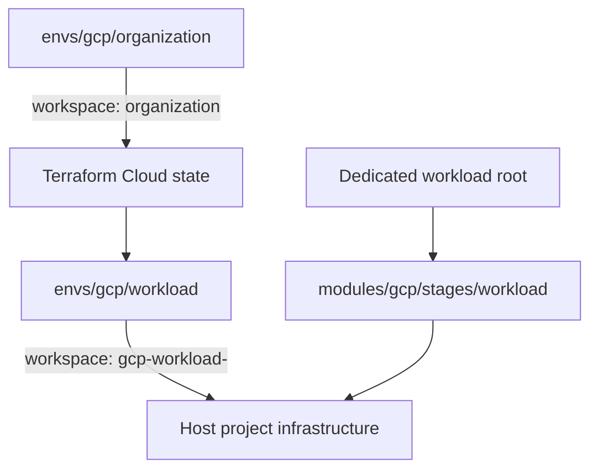

# System Architecture

## Overview

This repository implements a GCP landing zone alongside a Terraform-native AWS landing zone. The GCP surface has two supported roots:

- `envs/gcp/organization` for the control plane
- `envs/gcp/workload` for environment-specific application infrastructure

The AWS surface adds a set of per-layer roots (`envs/aws/*`) plus a cloud-agnostic `envs/saas` root — see [AWS Landing Zone](#aws-landing-zone) below and the full detail in [`aws-landing-zone.md`](aws-landing-zone.md). Cloud selection is which workspaces you apply, not a runtime flag; the rationale lives in [`provider-selection.md`](provider-selection.md).

The design target is a low-touch platform that is easy to extend without copying roots or editing workflow matrices.

## Supported Roots

```text
envs/
├── gcp/
│   ├── organization/     # GCP control plane
│   └── workload/         # GCP per-environment app infra
├── aws/
│   ├── organization/     # AWS org, OUs, SCPs, foundational accounts
│   ├── security/         # AWS log archive, CloudTrail, GuardDuty, Security Hub, Config
│   ├── network/          # AWS Transit Gateway hub, inspection VPC, IPAM
│   ├── identity/         # AWS IAM Identity Center permission sets/assignments
│   ├── shared-services/  # AWS shared platform services (optional)
│   ├── backup/           # AWS centralized backup vaults + org backup plan
│   └── workload/         # AWS per-env workloads (TF_WORKSPACE=aws-workload-<env>)
└── saas/                 # Supabase and/or Vercel only — no AWS/GCP provider
```

### `envs/gcp/organization`

Creates and manages:

- admin project
- Terraform admin service account
- workload identity providers
- folders and folder IAM
- shared projects
- per-environment host projects
- org policy
- tags
- centralized audit logging
- SCC notifications
- billing export and budgets
- hub networking

This root composes four stage modules:

- `modules/gcp/stages/bootstrap`
- `modules/gcp/stages/organization`
- `modules/gcp/stages/projects`
- `modules/gcp/stages/network-hub`

### `envs/gcp/workload`

Consumes remote state from the `gcp-organization` workspace and deploys one environment at a time into the selected host project.

The workspace naming contract is:

- `gcp-organization`
- `gcp-workload-dev`
- `gcp-workload-uat`
- `gcp-workload-prod`
- `gcp-workload-<env>` for any new environment

## Environment Model

The canonical environment contract lives in `envs/gcp/organization/variables.tf`:

```hcl
map(object({
  display_name            = string
  region                  = string
  cidr_block              = string
  budget_monthly_limit    = number
  iam_group_role_bindings = map(set(string))
  labels                  = optional(map(string), {})
}))
```

That keeps CIDRs explicit and stable. The old pattern of deriving CIDRs from key ordering is no longer part of the platform.

## Module Layering

### Stage Modules

- `modules/gcp/stages/bootstrap`
  - admin project
  - Terraform admin service account
  - GitHub and Terraform Cloud workload identity

- `modules/gcp/stages/organization`
  - folders
  - tags
  - org policy
  - audit logging
  - SCC notifications
  - billing export and budget alerts — optional email notifications are delivered via a **Cloud Functions gen2** function backed by Cloud Run v2; set `vpc_connector` when the `cloudfunctions.requireVPCConnector` org policy is enforced

- `modules/gcp/stages/projects`
  - shared platform projects
  - one host project per declared environment

- `modules/gcp/stages/network-hub`
  - shared hub VPC
  - shared DNS
  - hierarchical firewall
  - organization-spanning connectivity
  - VPC Service Controls perimeter — `spoke_project_numbers` must contain **numeric project numbers** (e.g. `"123456789012"`), not project ID strings; the Access Context Manager API rejects project ID strings with a misleading permission error

- `modules/gcp/stages/workload`
  - separate service projects that attach to a Shared VPC host

- `modules/saas/stages/saas-workload`
  - Supabase project, settings, and API keys (via `supabase/environment`)
  - Supabase Vault secret reconciliation — Node.js provisioner, UPPER_SNAKE_CASE namespace, safety guard (via `supabase/vault-secrets`, gated by `enable_vault_secrets`)
  - Vercel project with QA/preview, UAT/custom, and production three-tier environments (via `vercel/project`, gated by `enable_vercel`)
  - Designed for phased deployment: apply Supabase first, then opt in to vault-secrets and Vercel separately

### Shared Infrastructure Modules

Both clouds expose reusable primitives under the **same domain folders**, so a capability maps across providers by directory name. Full capability-by-capability catalog: **[Module Library in the README →](../../README.md#module-library)**.

| Domain | Google Cloud (`modules/gcp/*`) | Amazon Web Services (`modules/aws/*`) |
|:-------|:-------------------------------|:--------------------------------------|
| Networking | `network/*` — VPC, subnets, DNS, NAT, LB, firewalls, VPN, VPC-SC | `network/*` — VPC, Transit Gateway, IPAM, endpoints, Network Firewall, Route 53 Resolver |
| IAM &amp; Identity | `iam/*` — org bindings, roles, service accounts, workload identity, groups | `iam/*` — IAM roles, IAM Identity Center |
| Security &amp; detection | `governance/scc`, `governance/cloud-audit-logs` | `security/*` — GuardDuty, Security Hub, Config, CloudTrail, Security Lake, delegated admin, edge/WAF |
| Governance | `governance/*` — org policy, tags, budgets | `governance/*` — Organizations, SCP/RCP, account baseline, cost governance, service quotas |
| Data, storage &amp; encryption | `cloud-storage`, `artifact-registry`, `governance/kms` | `data/*` — log archive bucket, KMS keys, private CA |
| Backup | *(GCS lifecycle / snapshots — no dedicated module)* | `backup/*` — vaults, org backup policy |
| Observability &amp; ops | `monitoring/*` — alert policies, dashboards | `ops/systems-manager` |
| Application platform | `firebase/project` | *(Amplify / App Runner — no module)* |
| Orchestration stages | `stages/*` — bootstrap, organization, projects, network-hub, workload, host | `stages/*` — organization, security, network-hub, shared-services, backup, workload |

`modules/gcp/stages/host` is the Shared VPC host-project network stage used by `envs/gcp/workload`; the AWS equivalent per-account baseline lives in `modules/aws/stages/workload`.

### SaaS Modules

- `modules/supabase/*` contains Supabase primitives consumed by the `saas-workload` stage:
  - `project` — creates a `supabase_project`; lifecycle guard ignores `database_password` after initial creation (Management API limitation)
  - `settings` — manages auth and API settings on an existing project via `supabase_settings`; destroying this resource is a no-op by provider design (settings revert to Supabase defaults)
  - `environment` — composite module: project + settings + `data.supabase_apikeys`; primary building block for per-environment deployments
  - `vault-secrets` — bootstraps the Supabase Vault with `SECURITY DEFINER` helper functions and reconciles a desired-state `map(string)` of secrets; requires Node.js >= 18 + `pg ^8.20.0`; IaC namespace is scoped to `UPPER_SNAKE_CASE` keys only; a safety guard blocks wiping a non-empty vault when the desired set is empty
- `modules/vercel/*` contains Vercel primitives:
  - `project` — creates a Vercel project with three environments (QA/preview, UAT/custom, production); sensitive environment variables are managed via `terraform_data` SHA256 drift-resistance triggers; `ignore_command` uses POSIX sh (`if/then/else/fi`, exit 1 = build, exit 0 = skip)

## AWS Landing Zone

The AWS surface is a Terraform-native, multi-account landing zone modelled on the AWS Security Reference Architecture (SRA). It is composed of per-layer roots under `envs/aws/*` plus a cloud-agnostic `envs/saas` root, each mapping to exactly one Terraform Cloud workspace.

### Account model

The SRA account topology spans a **Management** account (org root), **Log Archive** and **Security Tooling** accounts (delegated security admin), a **Network** account (Transit Gateway hub + inspection), **Shared Services**, **Backup**, **Forensics**, and one or more **Workload** accounts. OU structure, guardrails (SCP/RCP/declarative/tag/backup policies), and account provisioning live in the `aws-organization` layer.

### Layer order

Each layer is one root = one workspace; ordering is enforced by **apply order + remote-state reads**, not cross-root `depends_on`:

```text
aws-organization → aws-security → aws-network → aws-identity
                 → aws-shared-services → aws-backup → aws-workload
```

The **minimum governed footprint** is `aws-organization` + `aws-security`; everything from `aws-network` down is additive. `envs/saas` sits deliberately outside the AWS chain — it configures no AWS credentials and is selected purely by whether you apply its workspace.

### Two-phase bootstrap

AWS stand-up begins with a phase-0 bootstrap (out-of-band org creation and a runnable `aws-organization` workspace) before the layered roots can be applied. IAM Identity Center is enabled/delegated between the organization and security/identity layers.

> Full account/OU diagrams, network and security topology, and the SRA conformance checklist: **[AWS Landing Zone →](aws-landing-zone.md)**. Stand-up procedure: **[AWS Bootstrap runbook →](../runbooks/aws-bootstrap.md)**.

## State and Execution Model

### Control Flow


```mermaid
graph TD
    A["envs/gcp/organization"] -->|workspace: organization| B["Terraform Cloud state"]
    B --> C["envs/gcp/workload"]
    C -->|workspace: gcp-workload-<env>| D["Host project infrastructure"]
    E["Dedicated workload root"] --> F["modules/gcp/stages/workload"]
    F --> D
```

### Responsibilities

- Terraform Cloud owns remote state and live plan/apply execution.
- GitHub Actions validates code on pull requests.
- Release tags only publish GitHub release metadata after confirming a successful Terraform Cloud run.

GitHub tags do **not** apply infrastructure directly.

## CI/CD

### Pull Requests

The validation workflow runs:

- `terraform fmt -check`
- terraform-docs drift check
- `terraform init -backend=false`
- `terraform validate`
- `tflint`
- `tfsec`
- `checkov`

### Tags

The release-metadata workflow listens for:

- `gcp-organization/vX.Y.Z`
- `gcp-workload/<env>/vX.Y.Z`

It verifies the latest Terraform Cloud run for the matching workspace and then publishes a GitHub release.

## Operator Model

### Control Plane

```bash
terraform -chdir=envs/gcp/organization init
terraform -chdir=envs/gcp/organization plan
```

### App Environment

```bash
TF_WORKSPACE=gcp-workload-dev terraform -chdir=envs/gcp/workload init
TF_WORKSPACE=gcp-workload-dev terraform -chdir=envs/gcp/workload plan -var-file=../../../examples/dev.tfvars
```

### Workload Projects

Service projects should be created from a dedicated workload root that calls `modules/gcp/stages/workload`. They should not be created inside the host project itself.

## Current Boundaries

- The repository does not yet include a first-class workload root beyond `examples/workloads/`, which is a complete, working reference implementation of `modules/gcp/stages/workload`.
- Local `make validate-all` requires access to `registry.terraform.io`.
- Local `make lint` depends on a healthy TFLint Google ruleset plugin installation.
