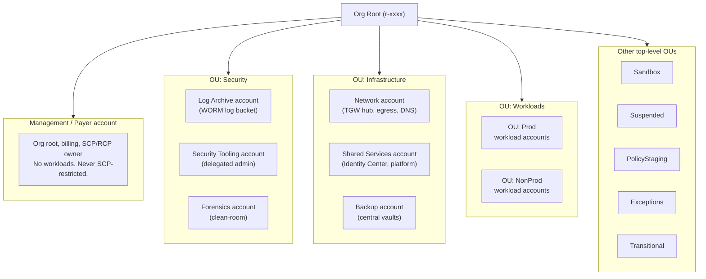
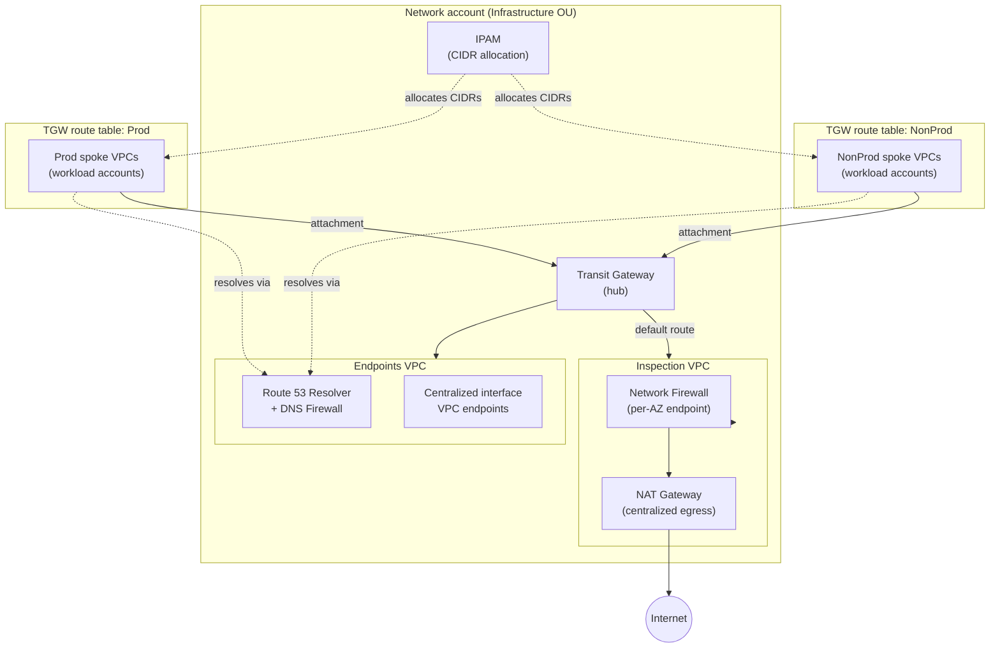

# AWS Landing Zone

This document is the authoritative description of the AWS landing zone deployed by this repository: the account and OU model, which root deploys which layer, the network topology, the security services and guardrails, the cost profile of the always-on baseline, and the IPv6 posture. It implements the **AWS Security Reference Architecture (SRA)** on top of the [per-cloud-root model](provider-selection.md) — AWS lives entirely in `envs/aws-*` roots, physically separate from the GCP control plane so that neither cloud forces the other's credentials.

For how to *stand this up* see [`docs/runbooks/aws-bootstrap.md`](../runbooks/aws-bootstrap.md); for the cross-root wiring contract see [`docs/architecture/adding-a-cloud.md`](adding-a-cloud.md).

---

## Account & OU model

The organization follows the AWS SRA foundational layout: a small set of purpose-built member accounts hung off an OU tree, with the management (payer) account holding the org root and running no workloads.

**Top-level OUs** (`modules/aws/organization` var `top_level_ous`, default the SRA set): `Security`, `Infrastructure`, `Workloads`, `Sandbox`, `Suspended`, `PolicyStaging`, `Exceptions`, `Transitional`. **Child OUs** under `Workloads` (`child_ous`): `Prod` and `NonProd`.

**Foundational accounts** (`envs/aws-organization/terraform.tfvars` `accounts` map, keyed by name with an `ou` placement):

| Account key | OU | Purpose |
|---|---|---|
| `log_archive` | Security | Immutable log archive — the WORM S3 bucket (`modules/aws/log-archive-bucket`). |
| `security_tooling` | Security | Delegated administrator for GuardDuty, Security Hub, Config aggregator, Access Analyzer, Macie, Inspector, Detective, Security Lake. |
| `forensics` | Security | Isolated clean-room account for incident investigation and cross-account EBS-snapshot analysis. |
| `network` | Infrastructure | Transit Gateway hub, centralized egress/inspection, IPAM, Route 53 resolver. |
| `shared_services` | Infrastructure | IAM Identity Center delegated admin, shared platform services. |
| `backup` | Infrastructure | Centralized AWS Backup vaults and org backup plan. |
| `<workload>` | Workloads/Prod or Workloads/NonProd | Per-environment workload accounts (`workload_accounts` map). |

The account keys are the exact keys of the `account_ids` / `account_role_arns` outputs the org root publishes — the [cross-root contract](adding-a-cloud.md#4-stable-output-keys-are-the-cross-root-contract).

---

## Layer map — which root deploys what

Each layer is one root = one Terraform Cloud workspace (see [provider-selection](provider-selection.md)). Ordering is enforced by **apply order + remote-state reads**, not by any cross-root `depends_on`.

| Order | Root | Workspace | Deploys | Stage module |
|---|---|---|---|---|
| 1 | `envs/aws-organization` | `aws-organization` | Org, SRA OU tree, foundational accounts, guardrails (SCP/RCP/declarative/tag/backup). Publishes `account_ids`, `account_role_arns`. | `modules/stages/aws-organization` |
| 2 | `envs/aws-security` | `aws-security` | Log archive (WORM), org CloudTrail, Config aggregator, GuardDuty, Security Hub CSPM, Access Analyzer, Security Lake, delegated-admin wiring, incident-response. | `modules/stages/aws-security` |
| 3 | `envs/aws-network` | `aws-network` | TGW hub, inspection VPC + Network Firewall, centralized egress (NAT), IPAM, centralized VPC endpoints, Route 53 resolver/DNS firewall. | `modules/stages/aws-network-hub` |
| 4 | `envs/aws-identity` | `aws-identity` | IAM Identity Center permission sets and account assignments (after Identity Center is delegated to Shared Services). | — |
| 5 | `envs/aws-shared-services` | `aws-shared-services` | Shared platform services (optional / gated). | `modules/stages/aws-shared-services` |
| 6 | `envs/aws-backup` | `aws-backup` | Centralized backup vaults (Vault Lock) and org backup plan. | `modules/stages/aws-backup` |
| 7 | `envs/aws-workload` | `aws-workload-<env>` | Per-env spoke VPC, workload roles, per-account baseline. One workspace per env via the `aws-workload-` prefix. | `modules/stages/aws-workload` |
| — | `envs/saas` | `saas-<name>` | Supabase and/or Vercel only. **No AWS provider** — reads AWS/GCP remote state for values but configures no AWS credentials. | `modules/stages/saas-workload` |

The **minimum governed footprint** is `aws-organization` + `aws-security`; everything from `aws-network` down is additive. The `saas` root is deliberately outside the AWS chain: it is selected purely by whether you apply its workspace, and it needs no AWS credentials.

---

## Network topology

A Transit Gateway hub-and-spoke in the Network account, with prod/nonprod route-table segmentation, a centralized inspection VPC fronted by AWS Network Firewall, centralized egress via NAT, IPAM-managed CIDRs, centralized interface VPC endpoints, and Route 53 Resolver with DNS Firewall.

- **Segmentation.** Prod and NonProd spokes attach to the same TGW but use **separate route tables**, so prod↔nonprod lateral traffic is not routable by default; both send egress/inter-VPC traffic through the inspection VPC.
- **Centralized inspection.** All north-south (and configurable east-west) traffic is default-routed to the inspection VPC, where **AWS Network Firewall** (`modules/aws/network-firewall`) inspects it before it reaches the NAT gateway.
- **Centralized egress.** NAT lives once in the Network account, not per spoke — spokes have no NAT of their own.
- **IPAM.** `modules/aws/ipam` owns the address plan; spoke CIDRs are allocated from IPAM pools to prevent overlap.
- **Centralized endpoints.** Interface VPC endpoints (`modules/aws/vpc-endpoints`) are created once and shared over the TGW, so spokes reach AWS APIs privately without per-VPC endpoint sprawl.
- **DNS.** `modules/aws/route53-resolver` provides inbound/outbound resolver endpoints and a **DNS Firewall** for domain-level egress control.
- **Analysis.** `modules/aws/network-access-analyzer` provides reachability analysis over the topology.

---

## Security services

The SRA security stack is delegated from the management account to the **Security Tooling** account, which is the single delegated administrator for the org-wide services. The **Log Archive** account is the immutable sink.

| Service | Module | Delegation / notes |
|---|---|---|
| CloudTrail (org trail) | `modules/aws/cloudtrail-org` | Org-wide multi-Region trail → Log Archive bucket. |
| AWS Config (org) | `modules/aws/config-org` | Recorder per Region + org aggregator in Security Tooling. |
| GuardDuty (org) | `modules/aws/guardduty-org` | Delegated admin; auto-enroll new accounts; EBS malware protection. |
| Security Hub CSPM | `modules/aws/securityhub-org` | Central configuration policy associated at the org root. |
| Access Analyzer (org) | `modules/aws/access-analyzer-org` | Org-scoped external/unused-access analyzers. |
| Macie / Inspector / Detective | via `modules/aws/org-security-service` / `security-delegated-admin` | Delegated to Security Tooling. |
| Security Lake | `modules/aws/securitylake` | Normalized OCSF lake; **cost-gated** (see below). |
| Systems Manager | `modules/aws/systems-manager` | Fleet/patch baseline. |
| Firewall Manager | `modules/aws/firewall-manager-org` | Org-wide WAF/SG policy. |
| Incident response | `modules/aws/incident-response` | GuardDuty→EventBridge→isolation Lambda; forensics snapshot-share role. |
| Notifications | `modules/aws/security-notifications` | Finding fan-out. |

### Guardrails

`modules/aws/organization-policy` renders all five AWS Organizations policy types:

- **SCPs** (three): `deny-tamper` (protect logging/security config), `region-restriction`, and a `baseline` deny set.
- **RCP** (resource control policy): a two-statement data perimeter (org-identity + confused-deputy + secure-transport / `aws:PrincipalOrgID`).
- **Declarative** EC2 policy (`@@assign`): enforce IMDSv2, block public AMIs / public access.
- **Tag policy**: enforce required tags.
- **Backup policy**: daily org backup plan.

`FullAWSAccess` / `RCPFullAWSAccess` remain AWS-managed and are never managed here.

### Root-access management & break-glass

- The **management account is never restricted by SCPs** — AWS does not apply SCPs to the org root's own account. It must therefore be secured out-of-band: hardware MFA on root, no root access keys. See [`aws-break-glass.md`](../runbooks/aws-break-glass.md).
- The **break-glass role** ARN (`break_glass_role_arn`) is an account-qualified exact ARN that is **carved out of every guardrail deny statement**, so a genuine incident can bypass the SCPs. It is disabled-by-default (deny-all standing policy) and MFA-required.

### Incident response & forensics

`modules/aws/incident-response` wires a GuardDuty finding (severity ≥ 7) → EventBridge rule → isolation Lambda (attach quarantine SG). The `ir-forensics-snapshot-share` role is trusted only by the **Forensics account** principal and further scoped by `aws:PrincipalOrgID`, for cross-account EBS-snapshot sharing into the forensics clean-room. See [`aws-incident-response.md`](../runbooks/aws-incident-response.md).

---

## Cost of the security baseline

The governed baseline is intentionally always-on, but several services dominate the bill. Each is gated so you can right-size for a given environment:

| Service | Cost driver | Toggle | Default |
|---|---|---|---|
| AWS Config | Records **all** supported resource types in **every Region** — the most expensive Config mode. | `record_all_supported` (`modules/aws/config-org`) | `true` |
| Security Lake | Ingestion + storage + OCSF normalization charges. | `enable_security_lake` (`modules/aws/securitylake`) | `true` |
| Network Firewall | Billed **per endpoint-hour** (one endpoint per firewall subnet, i.e. per-AZ) plus per-GB processed. | `enable_network_firewall` (`modules/aws/network-firewall`) | `true` |
| GuardDuty EBS malware | Agentless EBS malware scanning billed per GB scanned. | `enable_ebs_malware_protection` (`modules/aws/guardduty-org`) | `true` |
| Any Regional service | Cost scales with the number of enabled Regions. | Per-Region enable lists on the relevant roots. | — |

Right-sizing guidance: for cost-sensitive non-prod, set `record_all_supported = false` (and pair with a narrower recording group managed out-of-band), consider `enable_security_lake = false`, reduce the per-AZ Network Firewall footprint or set `enable_network_firewall = false` where a spoke does not need inline inspection, and disable `enable_ebs_malware_protection` where agentless scanning is not required. Keep the full set on for prod.

---

## IPv6 posture

The landing zone is **IPv4-only by default**. The `modules/aws/vpc` module exposes an `enable_ipv6` variable (default `false`) that assigns an Amazon-provided `/56` IPv6 CIDR block to the VPC, providing a dual-stack path when a specific workload needs it. Enable it per-VPC rather than org-wide; the TGW segmentation and inspection topology above are described for the default IPv4 case.

---

## SRA citations

This architecture follows AWS Prescriptive Guidance. Primary sources:

- **AWS Security Reference Architecture (SRA)** — <https://docs.aws.amazon.com/prescriptive-guidance/latest/security-reference-architecture/welcome.html>
- **Organizing Your AWS Environment Using Multiple Accounts** (whitepaper, 2025-04-30) — <https://docs.aws.amazon.com/whitepapers/latest/organizing-your-aws-environment/organizing-your-aws-environment.html>
- **Building a Scalable and Secure Multi-VPC AWS Network Infrastructure** (whitepaper) — <https://docs.aws.amazon.com/whitepapers/latest/building-scalable-secure-multi-vpc-network-infrastructure/welcome.html>
- **AWS Security Reference Architecture: A cyber-forensics companion** — <https://docs.aws.amazon.com/prescriptive-guidance/latest/security-reference-architecture-cyber-forensics/welcome.html>

---

## See also

- [Provider Selection](provider-selection.md) — why one cloud = one root = one workspace.
- [Adding a Cloud](adding-a-cloud.md) — the cross-root contract.
- [AWS Bootstrap](../runbooks/aws-bootstrap.md) — phase-0 stand-up.
- [AWS Add Account](../runbooks/aws-add-account.md), [Break-Glass](../runbooks/aws-break-glass.md), [Incident Response](../runbooks/aws-incident-response.md), [Teardown](../runbooks/aws-teardown.md).
