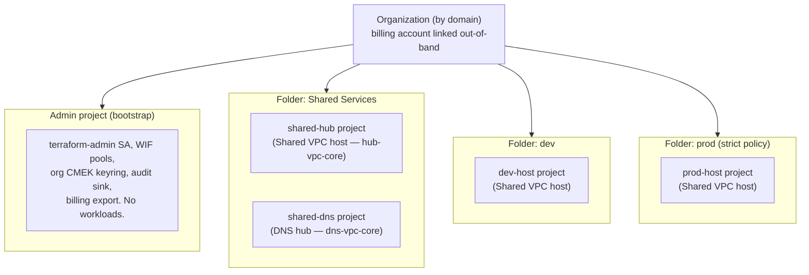
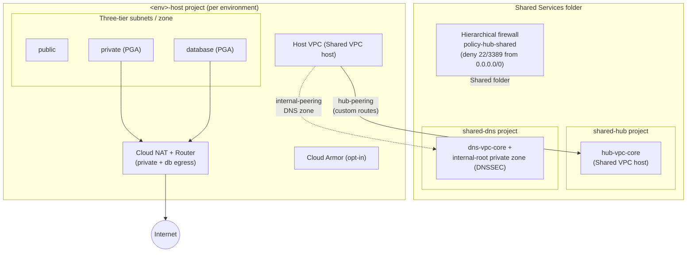

# GCP Landing Zone

This document is the authoritative description of the GCP landing zone deployed by this repository: the folder and project model, which root deploys which layer, the network topology, the security services and guardrails, the cost profile of the baseline, and the foundation-conformance mapping. It implements Google's enterprise-foundations pattern (**Cloud Foundation Fabric / FAST**) on top of the [per-cloud-root model](provider-selection.md) — GCP lives entirely in `envs/gcp/*` roots, physically separate from the AWS control plane so that neither cloud forces the other's credentials.

This is the GCP counterpart to [`aws-landing-zone.md`](aws-landing-zone.md); the two are written to the same section structure so you can compare the clouds control-for-control. For a capability-by-capability module map see the [Cross-Cloud Comparison](cross-cloud-comparison.md) and the [Module Library](../../README.md#module-library). For how to *stand this up* see [`docs/runbooks/add-environment.md`](../runbooks/add-environment.md); for the cross-root wiring contract see [`docs/architecture/adding-a-cloud.md`](adding-a-cloud.md).

> **Structural note.** Where the AWS SRA mandates seven layered roots (organization, security, network, identity, shared-services, backup, workload), GCP folds the same responsibilities into **two roots** — `gcp-organization` (bootstrap → organization → projects → network-hub, one apply) and `gcp-workload-<env>` (host + budget, per environment). Fewer accounts/roots is idiomatic for GCP, where a Shared VPC and org policies do centrally what AWS distributes across dedicated accounts.

---

## Folder & project model

GCP uses a **flat, single-level folder tree** parented directly at the organization: one `Shared Services` folder plus one folder per environment. Projects hang off those folders, with a separate bootstrap **admin project** holding the automation identity and control-plane state.

**Folders** (`modules/gcp/iam/organization` `google_folder.ou_folders`, `for_each = var.organizational_units`, all parented at `organizations/<id>`, `prevent_destroy = true`). The set is computed in `envs/gcp/organization/main.tf` as one `shared` folder plus one folder **per key in `var.environments`** (example: `dev`, `uat`, `prod`). There is deliberately **no nested Prod/NonProd tree** — segmentation is by per-environment folder, each bound to an `environment-<key>` tag value (`modules/gcp/stages/organization/tags_binding.tf`).

**Projects** (`modules/gcp/stages/projects` `google_project.projects`, `deletion_policy = "PREVENT"`, `auto_create_network = false`; IDs `"${project_prefix}-${ou}-${name}-${suffix}"`):

| Project key | Folder | Purpose |
|---|---|---|
| `shared-hub` | Shared Services | Network core — the Shared VPC **host** for the hub VPC (`hub-vpc-core`). |
| `shared-dns` | Shared Services | DNS core — the DNS hub VPC (`dns-vpc-core`) and private root zone. |
| `<env>-host` | per environment | Per-environment Shared VPC **host** project; workload service projects attach here. |
| *admin* | *(none — top-level)* | Bootstrap admin project: `terraform-admin` SA, WIF pools, org CMEK, audit sink. |

The environment folder/project keys are the exact keys of the `environment_config` output the org root publishes — the [cross-root contract](adding-a-cloud.md#4-stable-output-keys-are-the-cross-root-contract). A **dedicated logging project** is available but opt-in: `logging_project_id` (default `null` → the audit sink lives in the admin project). Separating it is a PREVIEW separation-of-duties item (see [`known-gaps.md`](../known-gaps.md)).

---

## Layer map — which root deploys what

Two roots, each one Terraform Cloud workspace (see [provider-selection](provider-selection.md)). The organization root composes four stage modules in a single apply; ordering **inside** it is by module dependency, and ordering **between** roots is by apply order + remote-state reads, not cross-root `depends_on`.

| Order | Root | Workspace | Deploys | Stage modules |
|---|---|---|---|---|
| 1 | `envs/gcp/organization` | `gcp-organization` | Bootstrap (admin project, WIF, Terraform SA) → organization (folders, org policy, tags, audit logs, SCC, org CMEK, budgets, essential contacts) → projects (shared + host projects) → network-hub (hub VPC, DNS hub, hub VPC-SC perimeter). Publishes `environment_config`, `hub_network`, `cmek_key_names`, WIF pool IDs. | `bootstrap`, `organization`, `projects`, `network-hub` |
| 2 | `envs/gcp/workload` | `gcp-workload-<env>` | Per-environment Shared VPC host network (three-tier subnets, NAT, firewall, hub peering, DNS peering, flow-logs export, optional Cloud Armor, per-env VPC-SC perimeter) + budget. One workspace per env via the `gcp-workload-` prefix. | `host`, `governance/billing` |
| — | `envs/saas` | `saas-<name>` | Supabase and/or Vercel only. **No GCP provider** — reads GCP/AWS remote state for values but configures no GCP credentials. | `modules/saas/stages/saas-workload` |

The **minimum governed footprint** is the `gcp-organization` root alone (it already stands up folders, guardrails, audit logging, SCC notifications, and the network hub); `gcp-workload-<env>` is additive, once per environment. The `saas` root is deliberately outside the GCP chain: it is selected purely by whether you apply its workspace, and it needs no GCP credentials.

**Cross-root outputs published by `gcp-organization`** (`envs/gcp/organization/outputs.tf`) — the contract `gcp-workload` consumes via `terraform_remote_state`:

- `environment_config` — per-env map: `folder_id`, `host_project_id`, `host_project_number`, `region`, `cidr_block`, `labels`, `tag_value_ids.environment`. The primary per-environment contract.
- `hub_network` — `vpc_self_link`, `vpc_name`, `dns_zone_name`, `dns_domain` (spoke → hub peering + DNS peering).
- `cmek_key_names` — CMEK key short-name → key ID, for downstream encryption.
- Foundational: `billing_account`, `admin_project`, `organization`/`org_id`, `folders`, `projects`, `terraform_service_account_email`, the GitHub/TFC OIDC pool + provider IDs, `tag_values`/`tag_keys`, `audit_logs_bucket_name`, `billing_export_dataset_id`, `scc_pubsub_topic_id`.

---

## Network topology

A **Shared VPC hub-and-spoke** built from a hub VPC in the `shared-hub` project, a DNS hub in `shared-dns`, and one Shared VPC host per environment that **peers** to the hub. GCP achieves with Shared VPC + VPC peering what the AWS side does with a Transit Gateway; the roles line up.

- **Segmentation.** Each environment's `<env>-host` project is a **Shared VPC host**; service projects attach to it, and the host VPC peers to the hub (`vpc_peerings["hub-peering"]`, custom routes exported/imported). Per-environment folders + per-host VPCs isolate environments; prod↔nonprod is not connected except through the hub.
- **Three-tier subnets.** `public` / `private` / `database` per zone, CIDRs auto-derived with `cidrsubnet(vpc_cidr, 8, …)`; `private` and `database` get Private Google Access. All tiers emit VPC Flow Logs.
- **Centralized egress.** Cloud NAT + Cloud Router per host VPC covers private + database subnets (logging on); there are no external IPs on VMs (`compute.vmExternalIpAccess` is denied org-wide).
- **DNS.** The DNS hub (`shared-dns`) serves an `internal-root` private zone (DNSSEC + query logging); each spoke resolves via an `internal-peering` zone pointing at the hub domain (default `internal.local`).
- **Private connectivity.** Private Service Access and Private Service Connect are **on by default** in the host stage, so managed services and Google APIs are reached privately. GCP uses per-project CIDRs rather than an AWS-style IPAM.
- **Firewall — two layers.** VPC-level **network firewall** rules enforce tier-to-tier flow (api-gw→public 443/80, public→compute, compute→db, IAP SSH/RDP from `35.235.240.0/20`, health checks from `35.191.0.0/16` + `130.211.0.0/22`, deny-db-egress, and a logged deny-all-ingress backstop). Folder-level **hierarchical firewall** (`policy-hub-shared`) denies inbound 22/3389 from the internet org-wide (use IAP instead).
- **Edge (opt-in).** Cloud Armor (OWASP / adaptive protection / Log4Shell) is available per host; at the workload-env level it defaults **off** and is enabled per environment.
- **Hybrid (opt-in, off by default).** HA-VPN, Dedicated/Partner Interconnect, packet mirroring, and internal load balancers are present in the host stage and enabled per environment as needed.

---

## Security services

The GCP security stack is centralized in the organization stage plus the network layer. GCP consolidates what the AWS SRA spreads across GuardDuty/Config/Security Hub/etc. into **Security Command Center + org policies + org-wide audit logs + VPC Service Controls**.

| Capability | Module | Delegation / notes |
|---|---|---|
| Org audit logging | `modules/gcp/governance/cloud-audit-logs` | Org-wide `iam_audit_config` (ADMIN_READ / DATA_READ / DATA_WRITE on all services) + org log sink (`include_children`) → CMEK-encrypted GCS bucket (UBLA, public-access-prevention enforced, versioned, lifecycle delete at `log_retention_days`, default 365). BigQuery analytics sink enabled by the org stage. |
| Posture / findings | `modules/gcp/governance/scc` | Security Command Center **notifications** — Pub/Sub topic `scc-findings` + notification config (`filter='state="ACTIVE"'`), CMEK-encrypted; optional severity-based multi-config routing. Does not itself enable SCC tiers (enablement is an org-level, out-of-band step). |
| Encryption keys (CMEK) | `modules/gcp/governance/kms` | Org CMEK keyring `${prefix}-org-cmek` with keys for `audit-logs`, `audit-analytics`, `billing-alerts`, `scc-notifications`, `billing-export`, each granted to the correct Google service agent. Default rotation 90 days, `SOFTWARE` protection, symmetric encrypt/decrypt. |
| Service perimeter | `modules/gcp/network/vpc-sc` | Two perimeters: a **hub** `hub-data-perimeter` protecting spoke project numbers, and a per-env `<env>_perimeter` protecting the host project (restricting bigquery/storage/secretmanager/cloudkms/pubsub/sqladmin/container/artifactregistry). Both gated on an existing Access Context Manager policy (`vpc_sc_access_policy_name`, default `null` = no perimeter); dry-run available. |
| Automation identity | `modules/gcp/iam/workload-identity` | Keyless Workload Identity Federation for GitHub Actions and Terraform Cloud (see below). Service-account **key creation and upload are disabled org-wide** by policy. |
| Observability | `modules/gcp/monitoring/*` | `alert-policy` (CPU/memory/Cloud Run error-rate & latency/uptime/log-based) and `compute-dashboard` (SLO scorecards). Library modules; every created project is attached to the admin project's metrics scope. |

### Guardrails

`modules/gcp/governance/org-policy` sets organization policies at two scopes.

**Org-wide** — list constraints: `gcp.resourceLocations` (= `allowed_regions`), `iam.allowedPolicyMemberDomains` (domain restriction), `compute.restrictVpcPeering` (in-org only), `compute.vmExternalIpAccess` (deny all — CIS 4.9). Boolean constraints (all enforced): skip default network creation, require Shielded VM, restrict Cloud SQL public IP, disable SA key creation + upload, disable serial-port access, uniform bucket-level access, storage public-access prevention, no automatic IAM grants for default SAs (CIS 1.4), require VPC connector for Cloud Functions, require Private Google Access.

**Prod folder only** (`strict_folder_policy_environment_keys`, default `["prod"]`): disable nested virtualization, disable guest-attributes access, require OS Login, disable internet-gateway use.

Tag keys `environment`, `business-unit`, `data-classification` are created org-wide (`modules/gcp/governance/tags`) and the `environment` tag is bound to each folder. **Essential Contacts** (security + billing) are registered at the org.

### Automation identity & break-glass

- **Keyless CI/CD.** The bootstrap stage creates the admin project, a `terraform-admin` service account (impersonated by the human `admin_email`), and two WIF pools: `github-pool` (restricted to `refs/heads/main` of the exact `org/repo`) and `tfc-pool` (each TFC workspace bound to the admin SA). No exported service-account keys — enforced by the org policy above.
- **First-apply bootstrap.** The providers impersonate the `terraform-admin` SA, but that SA is *created* by the bootstrap apply, so `terraform_admin_email` is nullable **only** for the very first apply (which runs as the human `admin_email`); subsequent applies impersonate the SA.
- **Break-glass.** `break_glass_user` (default `null`) is granted `roles/resourcemanager.organizationAdmin`. Note this differs from the AWS model: GCP org policies here do not carve a guardrail-exempt isolated principal — break-glass is a standing org-admin grant secured out-of-band. Hardening this into an isolated, audited role is tracked in [`known-gaps.md`](../known-gaps.md).
- **Privilege split (opt-in).** `enable_privilege_split` (default `false`, PREVIEW) creates a second `terraform-resman` SA and routes high-privilege roles (org policy, access-context-manager, logging admin, SCC admin, IAM security admin) to it, for separation of duties.

---

## Cost of the baseline

Unlike the AWS baseline (which is dominated by always-on Config / Security Lake / Network Firewall / GuardDuty malware scanning), the GCP baseline has **no single always-on expensive security service** — SCC here is notification-only and org policies are free. Cost is driven by opt-in data-plane features, each gated:

| Feature | Cost driver | Toggle | Default |
|---|---|---|---|
| VPC Flow Logs export | BigQuery + GCS storage of exported flow logs. | `enable_vpc_flow_logs_export` (host); forced on at workload root | Host: `false`; workload: on |
| BigQuery audit analytics | BigQuery storage + query of the audit-log sink. | `enable_bigquery_analytics` (org stage) | On (org stage) |
| Cloud Armor | Per-policy + per-rule + request charges. | `enable_cloud_armor` | Host: `true`; workload env: `false` |
| Cloud NAT | Per-gateway-hour + per-GB processed. | integral to `enable_networking` | On |
| Budgets | Free, but define the alerting envelope. | `monthly_budget_limit` / `monthly_budget_amount` (`> 0` to enable) | Workload: `0` (off); org: `1000` |
| Interconnect / VPN / packet mirroring | Per-hour + per-GB. | `enable_vpn`, `interconnects`, `packet_mirroring` | Off |

Right-sizing guidance: for cost-sensitive non-prod, leave Cloud Armor and hybrid connectivity off (the defaults), keep flow-logs export but shorten `flow_logs_retention_days`, and consider disabling BigQuery audit analytics where the GCS sink suffices. Keep the full set on for prod.

---

## IPv6 posture

The landing zone is **IPv4-only by default**. Subnets are provisioned with IPv4 CIDRs derived from each environment's `cidr_block`; enabling dual-stack is a per-subnet change on the relevant host VPC rather than an org-wide setting. The hub-and-spoke peering and firewall topology above is described for the default IPv4 case.

---

## Foundation Conformance Checklist

This table maps each Google enterprise-foundations / CIS control to the module and/or root that **implements** it here. Every row was confirmed against the module source, not just its README. (GCP has no single published "SRA" document; the reference points are the Cloud Foundation Fabric FAST stages, the Google enterprise-foundations blueprint, and the CIS Google Cloud Foundations Benchmark.)

| Control | Source | Implemented by | Notes |
|---|---|---|---|
| Numbered foundation stages (bootstrap → org → projects → network) | Cloud Foundation Fabric **FAST** | `envs/gcp/organization` composing `modules/gcp/stages/{bootstrap,organization,projects,network-hub}` | Single apply; stage order by module dependency. Tracks FAST's **classic numbered-stage model** (`modules/gcp/stages/README.md`); note upstream FAST has since restructured (e.g. a merged `0-org-setup` stage), so this is the classic layout, not the current upstream tree. |
| Folder hierarchy + per-env isolation | Enterprise foundations "resource hierarchy" | `modules/gcp/iam/organization` (`google_folder`, `prevent_destroy`) | Flat: one `Shared Services` folder + one per environment; `environment` tag bound to each folder. |
| Keyless automation identity (WIF) | Foundations "no service-account keys" | `modules/gcp/stages/bootstrap` + `modules/gcp/iam/workload-identity` | GitHub + TFC OIDC pools; SA key creation **and** upload disabled by org policy. |
| Org policy guardrails | CIS GCP Foundations Benchmark (latest v5.0.0, 2026-05); Google managed baseline | `modules/gcp/governance/org-policy` | ~15 constraints incl. deny external IP (CIS 4.9), no default-SA auto-grants (CIS 1.4), Shielded VM, UBLA, restrict SQL public IP, domain-restricted sharing. Stricter set on prod folders. Uses **legacy constraint names** (not the `*.managed.*` namespace) and **no custom constraints** yet — see [known-gaps G6](../known-gaps.md#modernization--latest-best-practice-gaps-2026-review). |
| Org-wide audit logging → retained, access-controlled sink | CIS "Logging & monitoring" | `modules/gcp/governance/cloud-audit-logs` | ADMIN_READ/DATA_READ/DATA_WRITE on all services; org sink `include_children` → CMEK GCS bucket (UBLA, public-access-prevention enforced, versioned, lifecycle retention default 365d) + BigQuery analytics. **Bucket lock (WORM) is not enabled** — the sink is durable and access-controlled but not immutable ([known-gaps G8](../known-gaps.md#modernization--latest-best-practice-gaps-2026-review)). |
| Security Command Center findings notification | Foundations "threat detection" | `modules/gcp/governance/scc` | Pub/Sub notification of ACTIVE findings, CMEK-encrypted; severity routing supported. This is **notification-only** — SCC tier enablement and the **security posture service** (drift detection) are out-of-band ([known-gaps G10](../known-gaps.md#modernization--latest-best-practice-gaps-2026-review)); target **Premium** (Enterprise tier sunsets 2027-05-21). |
| CMEK on sensitive stores | CIS "Encryption" / NIST SP 800-57 | `modules/gcp/governance/kms` | Org CMEK keyring; audit-logs, analytics, SCC, billing keys granted to the right service agents; 90-day rotation. |
| Shared VPC hub-and-spoke | Foundations "networking" | `modules/gcp/stages/network-hub` + `modules/gcp/stages/host` | Hub VPC + DNS hub; each env host VPC peers to the hub with custom routes; three-tier subnets. |
| Layered firewall (VPC + hierarchical) | CIS "Networking" / foundations | `modules/gcp/network/network-firewall` + `modules/gcp/network/hierarchical-firewall` | Tier-to-tier rules + logged deny-all backstop; folder-level deny of internet 22/3389 (IAP instead). The VPC layer uses **legacy `google_compute_firewall` rules**; Google now directs new builds to global/regional **network firewall policies** with IAM-governed secure tags — migration tracked in [known-gaps G7](../known-gaps.md#modernization--latest-best-practice-gaps-2026-review). The hierarchical layer already uses the modern `firewall_policy` construct. |
| Private connectivity, no external IPs | CIS 4.9 / foundations | host stage (PSA + PSC on by default) + `compute.vmExternalIpAccess` deny | Private Google Access on private/database tiers; managed services reached privately. |
| VPC Service Controls data perimeter | Foundations "data exfiltration protection" | `modules/gcp/network/vpc-sc` | Hub + per-env perimeters over storage/bigquery/secretmanager/kms/pubsub/etc.; gated on an ACM access policy; dry-run supported. |
| Cost governance (budgets, billing export) | Foundations "billing" | `modules/gcp/governance/billing` + org billing export | Per-env + org budgets (count-gated `> 0`); Cloud Billing → BigQuery export dataset + IAM. |
| Essential Contacts | Foundations "org setup" | `modules/gcp/stages/organization` | Security + billing contacts registered at the org. |
| Centralized observability | Foundations "monitoring" | `modules/gcp/monitoring/*` + `stages/projects` metrics scope | Alert policies + SLO dashboard; every project attached to the admin metrics scope. |

**Out-of-band prerequisites** (must exist before or alongside Terraform, not modelled as `google` resources here):

- **Organization + Cloud Identity / Workspace domain** — the org is looked up by domain (`data.google_organization`); it and the identity domain must pre-exist.
- **Billing account** — looked up and linked (`data.google_billing_account`); creation/linkage is a console/admin step.
- **First-apply impersonation bootstrap** — the very first `gcp-organization` apply runs as the human `admin_email` (who can impersonate); it *creates* the `terraform-admin` SA that all later applies impersonate.
- **Access Context Manager policy** — VPC-SC perimeters require an existing org-level ACM policy passed as `vpc_sc_access_policy_name`; with the default `null`, no perimeter is created.
- **SCC tier enablement** — `governance/scc` wires notifications; enabling SCC Standard/Premium/Enterprise tiers is an org-level, out-of-band step.
- **Cloud Billing → BigQuery export stream** — the dataset + IAM are created by Terraform, but toggling the export in the Billing console is manual.
- **TFC backend organization** — supplied out-of-band via `backend.hcl` / `TF_CLI_ARGS_init`.

**Gated / opt-in** (present but default-off, enable per environment): Cloud Armor at the workload root (`enable_cloud_armor`), HA-VPN (`enable_vpn`), Interconnect (`interconnects`), packet mirroring, CDN (`enable_cdn`), API Gateway (`enable_api_gateway`), the dedicated logging project (`logging_project_id`), and the bootstrap privilege split (`enable_privilege_split`). The last two, plus VPC-SC service expansion, are PREVIEW separation-of-duties items — see [`known-gaps.md`](../known-gaps.md).

---

## Citations

This architecture follows Google Cloud enterprise-foundations guidance. Primary sources (versions current as of this doc's 2026 review):

- **Google Cloud enterprise foundations blueprint** (last reviewed 2025-05-15; ref impl `terraform-example-foundation` v5.0.0, 2026-07-01) — <https://docs.cloud.google.com/architecture/blueprints/security-foundations>
- **Cloud Foundation Fabric / FAST** (classic staged model; upstream since restructured) — <https://github.com/GoogleCloudPlatform/cloud-foundation-fabric>
- **CIS Google Cloud Platform Foundation Benchmark** (latest v5.0.0, 2026-05-09; prior v4.0.0, 2025-05) — <https://www.cisecurity.org/benchmark/google_cloud_computing_platform>
- **GCP landing zone design** — <https://docs.cloud.google.com/architecture/landing-zones>

---

## See also

- [AWS Landing Zone](aws-landing-zone.md) — the AWS counterpart, same section structure, for control-for-control comparison.
- [Cross-Cloud Comparison](cross-cloud-comparison.md) — where each capability lives per cloud.
- [Provider Selection](provider-selection.md) — why one cloud = one root = one workspace.
- [Adding a Cloud](adding-a-cloud.md) — the cross-root contract.
- [Network Topology](network-topology.md) — hub-spoke layout, VPC-SC, WIF flows in depth.
- [Add Environment](../runbooks/add-environment.md), [Service Team Onboarding](../runbooks/service-team-onboarding.md), [KMS Rotation](../runbooks/kms-rotation.md), [CIDR Expansion](../runbooks/cidr-expansion.md), [Break Glass](../runbooks/break-glass.md).
