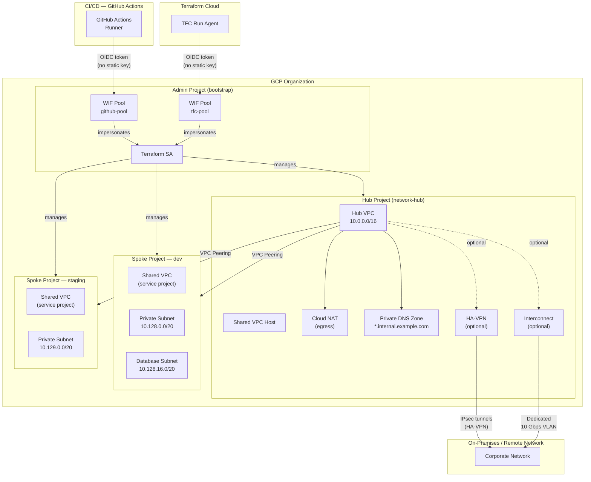
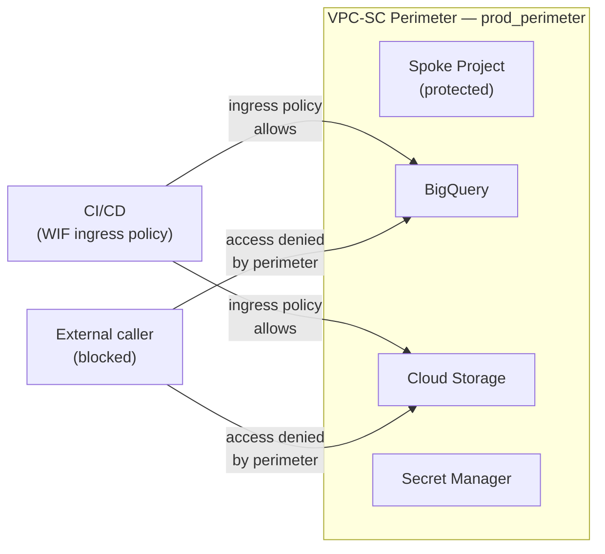
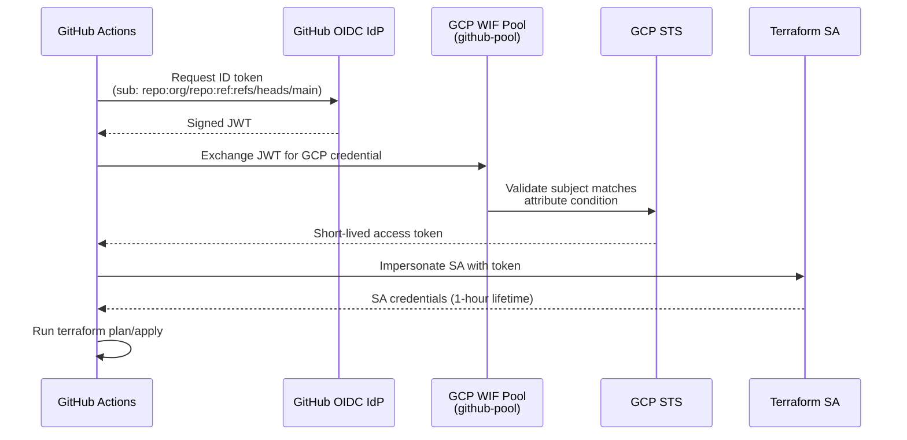
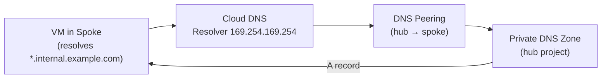

# Network Topology

This document describes the GCP network architecture deployed by this landing zone: a hub-spoke VPC topology with VPC Service Controls and Workload Identity Federation trust.

---

## Hub-Spoke Overview

---

## VPC Service Controls Boundary

When `vpc_service_controls.enabled = true`, a VPC-SC perimeter wraps the spoke project. Services listed in `restricted_services` (e.g., BigQuery, Cloud Storage, Secret Manager) cannot be called from outside the perimeter without an explicit ingress policy.

The perimeter starts in **dry-run mode** (`enable_dry_run = true`) — violations are logged to Cloud Audit Logs but not blocked. Flip to enforcement after validating that all legitimate callers have ingress policies.

---

## Workload Identity Federation Trust

No long-lived service account keys are used anywhere in the CI/CD pipeline.

The `attribute.repository` and `attribute.ref` conditions ensure that only workflows running from the configured repo and `main` branch can impersonate the Terraform SA. Pull request workflows receive read-only permissions via a separate condition.

---

## Subnet Layout

Each spoke environment gets two subnets within the configured VPC CIDR:

| Subnet | Purpose | CIDR (example for 10.128.0.0/16) |
|--------|---------|-----------------------------------|
| `{prefix}-private` | Application workloads | `10.128.0.0/20` |
| `{prefix}-database` | Cloud SQL, Memorystore | `10.128.16.0/20` |

Secondary IP ranges for GKE pods and services are allocated within the private subnet when `enable_gke = true`.

All subnets have VPC Flow Logs enabled and export to BigQuery via the Cloud Audit Logs sink.

---

## DNS Resolution Chain

Spoke projects use DNS peering to resolve records from the hub's private zone. No split-horizon or on-premises DNS forwarder configuration is included by default; add forwarding targets to `var.forwarding_targets` in the dns module if needed.

---

## Reference: Key Network Variables

| Variable | Module | Description |
|----------|--------|-------------|
| `vpc_cidr_block` | `modules/host` | VPC address space — must not overlap other VPCs. Required; no default. |
| `psa_prefix_length` | `modules/host` | Private Service Access prefix (16–29). Controls Cloud SQL connectivity range. |
| `vpn_tunnel_count` | `modules/host` | Number of HA-VPN tunnels (1 or 2). Must be 2 for 99.99% SLA. |
| `enable_interconnect` | `modules/host` | Provision Dedicated Interconnect VLAN attachment. |
| `vpc_service_controls` | `modules/host` | Object controlling VPC-SC perimeter config. |
