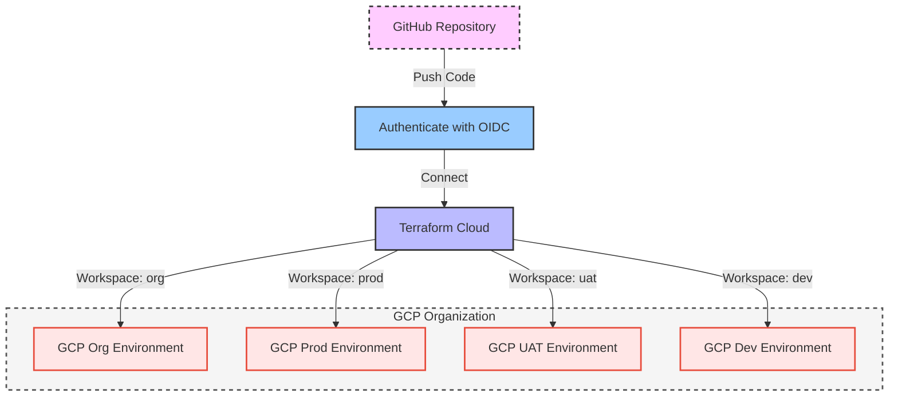
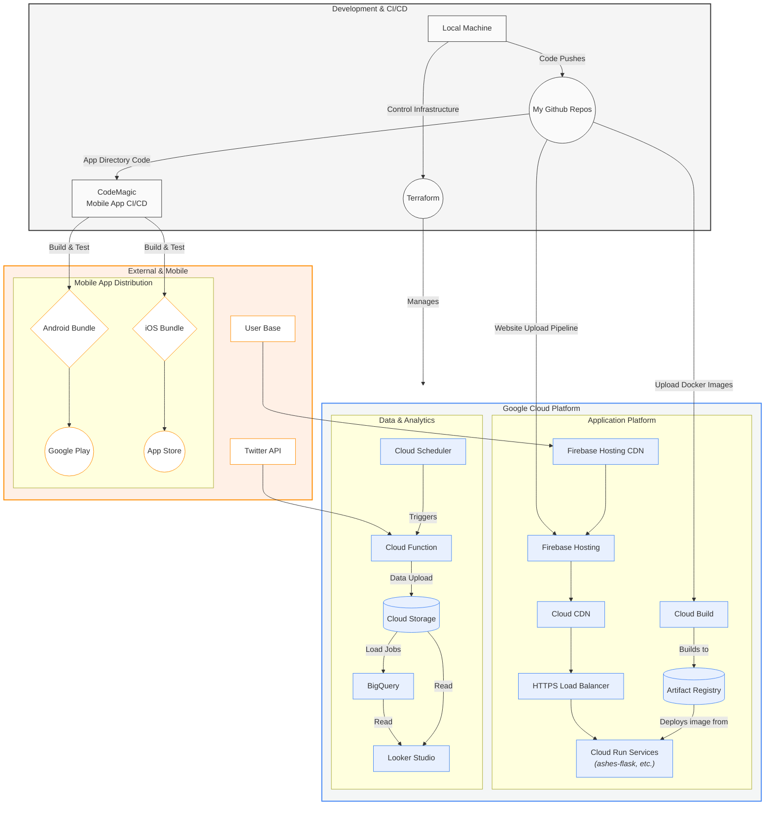

<div align="center">

# The Ashes Project DevOps Tools

*Infrastructure as Code for scalable, secure, and maintainable cloud architecture*

[](https://terraform.io)
[](https://cloud.google.com)
[](https://en.wikipedia.org/wiki/Infrastructure_as_code)
[](https://github.com/terraform-linters/tflint)
[](https://github.com/aquasecurity/tfsec)

</div>

---

## Table of Contents
- [The Ashes Project DevOps Tools](#the-ashes-project-devops-tools)
  - [Table of Contents](#table-of-contents)
  - [Project Overview](#project-overview)
    - [Key Features](#key-features)
  - [Architecture Principles](#architecture-principles)
    - [1. **Scalability and Elasticity**](#1-scalability-and-elasticity)
    - [2. **Reliability and Availability**](#2-reliability-and-availability)
    - [3. **Security and Compliance**](#3-security-and-compliance)
    - [4. **Cost Optimization**](#4-cost-optimization)
    - [5. **Performance and Monitoring**](#5-performance-and-monitoring)
    - [6. **Modularity in Infrastructure as Code (IaC)**](#6-modularity-in-infrastructure-as-code-iac)
  - [Getting Started](#getting-started)
    - [Prerequisites](#prerequisites)
    - [Quick Setup](#quick-setup)
    - [Local Environment Configuration](#local-environment-configuration)
  - [Usage Guide](#usage-guide)
    - [Local Development](#local-development)
    - [Automated Pipeline](#automated-pipeline)
    - [Identity \& Access Management](#identity--access-management)
    - [Application Services](#application-services)
    - [Governance \& Compliance](#governance--compliance)
    - [Host Services](#host-services)
  - [The Ashes Project Architecture](#the-ashes-project-architecture)

---

## Project Overview

As part of the ongoing development of the **Ashes project**, this repository contains the complete Infrastructure as Code (IaC) implementation for rebuilding and managing cloud infrastructure without relying on the GCP UI. 

### Key Features
- **Disaster Recovery Ready**: Complete infrastructure rebuild capability
- **CI/CD Integration**: Seamless integration with code repositories
- **Multi-Environment Support**: Dev, UAT, and Production environments
- **Security First**: Built-in governance and compliance
- **Scalable Architecture**: Designed for growth and flexibility

---

## Architecture Principles

### 1. **Scalability and Elasticity**
Ensure your infrastructure can dynamically scale to meet demand, utilizing both vertical and horizontal scaling. Implement auto-scaling to optimize resource usage and minimize costs during periods of low demand.

### 2. **Reliability and Availability**
Design for high availability with redundancy across multiple zones or regions to eliminate single points of failure. Leverage services with strong uptime SLAs and establish robust backup and disaster recovery plans to maintain operational continuity.

### 3. **Security and Compliance**
Safeguard your data with end-to-end encryption, strict access controls, and effective identity and access management (IAM) policies. Ensure compliance with relevant regulatory standards (e.g., GDPR, HIPAA) and conduct regular vulnerability assessments and patch management.

**ISO27001 Information Security Management Principles**:
- **Risk Assessment and Management**: Systematic identification, analysis, and treatment of information security risks
- **Access Control**: Implement principle of least privilege and role-based access controls
- **Information Security Policies**: Establish, implement, and maintain comprehensive security policies
- **Incident Management**: Define procedures for detecting, responding to, and recovering from security incidents
- **Supplier Relationship Security**: Ensure third-party and cloud service providers meet security requirements
- **Asset Management**: Maintain inventory and classification of information assets
- **Physical and Environmental Security**: Protect facilities, equipment, and information processing areas

**ISO22301 Business Continuity Management Principles**:
- **Business Impact Analysis**: Identify critical business functions and assess potential disruption impacts
- **Risk Assessment**: Evaluate threats and vulnerabilities that could disrupt business operations
- **Business Continuity Strategy**: Develop strategies to maintain operations during disruptions
- **Incident Response Planning**: Establish procedures for responding to business disruption incidents
- **Recovery Time Objectives (RTO)**: Define acceptable timeframes for restoring business functions
- **Recovery Point Objectives (RPO)**: Determine acceptable data loss parameters during incidents
- **Testing and Exercising**: Regularly test business continuity plans and response procedures
- **Continuous Improvement**: Monitor, review, and improve business continuity capabilities

### 4. **Cost Optimization**
Optimize resource utilization to control costs by utilizing reserved instances, auto-scaling, and serverless architectures where appropriate. Regularly assess resource consumption and use cloud provider tools for expense monitoring and optimization.

### 5. **Performance and Monitoring**
Implement comprehensive monitoring and logging systems to gain real-time insights into resource performance and detect anomalies early. Utilize tools that provide visibility into key metrics such as CPU, memory, storage usage, and network latency to ensure optimal performance.

### 6. **Modularity in Infrastructure as Code (IaC)**
Design your Infrastructure as Code (IaC) to be modular, promoting flexibility for future configurations. This approach enhances repository efficiency and simplifies the management of new features and updates.

---

## Getting Started

### Prerequisites
- **Terraform** >= 1.0
- **Google Cloud SDK** configured
- **Git** for version control
- Valid **GCP Project** with billing enabled

### Quick Setup

1. **Make the setup script executable:**
   ```bash
   chmod +x scripts/setup.sh
   ```

2. **Execute the setup script:**
   ```bash
   ./scripts/setup.sh
   ```

### Local Environment Configuration

> **Security Note**: No secrets or project-specific details are included in this repository. All sensitive information is managed through a secure secret management system.

Create an `init.tf` file in the root directory:

```hcl
terraform {
  required_providers {
    google = {
      source  = "hashicorp/google"
      version = "4.51.0"
    }
  }
}

provider "google" {
  project = "{your project name: string}"
  region  = "{your project region: string}"
}
```

**Authentication Options:**
- Link GCP credentials to your command line
- Provide service account credentials in the init file

---

## Usage Guide

### Local Development

**Plan your changes:**
```bash
terraform plan
```
*This shows what will be created or updated*

**Apply your changes:**
```bash
terraform apply
```
*This provisions/updates your cloud resources*

### Automated Pipeline

The automated pipeline leverages **OpenID Connect (OIDC)** for secure authentication between GitHub, Terraform Cloud, and GCP:



</details>

<details>
<summary><strong>API Gateway</strong></summary>

**Purpose**: Managed gateway for API traffic management

**Key Features**:
- Authentication and authorization
- Rate limiting and quotas
- Analytics and monitoring
- Request/response transformation

</details>

### Identity & Access Management

<details>
<summary><strong>Organization IAM</strong></summary>

**Purpose**: Centralized identity and access management at the organization level

**Key Features**:
- Centralized user management
- Role-based access control (RBAC)
- Audit logging and compliance
- Multi-factor authentication support

</details>

<details>
<summary><strong>IAM Roles</strong></summary>

**Purpose**: Granular permission management through predefined and custom roles

**Role Types**:
- **Primitive**: Basic roles (Owner, Editor, Viewer)
- **Predefined**: Service-specific roles
- **Custom**: Tailored permission sets

</details>

<details>
<summary><strong>Identity Groups</strong></summary>

**Purpose**: Simplified user management through group-based permissions

**Benefits**:
- Simplified permission management
- Scalable user administration
- Consistent access control
- Easier compliance reporting

</details>

### Application Services

<details>
<summary><strong>Firebase Projects</strong></summary>

**Purpose**: Complete app development platform with real-time features

**Key Features**:
- Real-time database (Firestore)
- Authentication services
- Hosting for web applications
- Mobile app analytics
- Cloud functions integration

**Services**:
- Authentication
- Cloud Firestore
- Realtime Database
- Cloud Storage
- Hosting
- Cloud Messaging

</details>

### Governance & Compliance

<details>
<summary><strong>Billing Management</strong></summary>

**Purpose**: Cost monitoring and budget management across projects

**Features**:
- Detailed cost breakdowns
- Budget alerts and notifications
- Usage trend analysis
- Cost optimization recommendations

</details>

<details>
<summary><strong>Cloud Audit Logs</strong></summary>

**Purpose**: Comprehensive activity logging for security and compliance

**Log Types**:
- **Admin Activity**: Administrative actions
- **Data Access**: Data read/write operations
- **System Events**: GCP-initiated activities
- **Policy Denied**: Access denial events

</details>

### Host Services

<details>
<summary><strong>Unified Project Orchestration</strong></summary>

**Purpose**: Unified entry point for creating comprehensive project infrastructure with all necessary resources

**Key Features**:
- **Complete Project Provisioning**: Single module to deploy entire project infrastructure
- **Resource Orchestration**: Coordinates creation of compute, storage, network, and security resources
- **Cross-Module Integration**: Seamlessly integrates multiple infrastructure modules
- **Standardized Deployments**: Ensures consistent project setup across environments
- **Dependency Management**: Handles resource dependencies and proper creation order

**Resources Provisioned**:
- Compute resources (Cloud Run, Cloud Functions)
- Storage solutions (Cloud Storage, Artifact Registry)
- Network infrastructure (VPC, Firewall, Load Balancers)
- Security configurations (IAM, Cloud Armor)
- Monitoring and logging setup
- Application services integration

**Benefits**:
- **Simplified Deployment**: Single Terraform module call provisions entire project
- **Consistent Architecture**: Standardized resource configurations across projects
- **Reduced Complexity**: Eliminates need to manage multiple module dependencies
- **Faster Time-to-Market**: Rapid project infrastructure deployment
- **Best Practices Built-in**: Incorporates security and performance best practices

</details>

---

## The Ashes Project Architecture


