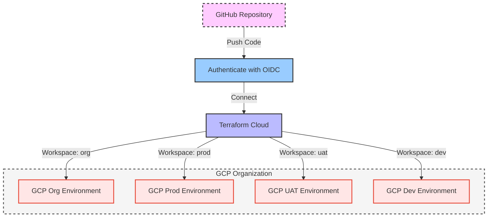

---


# The Ashes Project DevOps Tools

As part of the ongoing development of the Ashes project, I'm setting out and documenting the infrastructure. This documentation serves a crucial purpose: in case I lose access to my cloud environment, I need a way to quickly rebuild it without relying on the GCP UI. This repository contains the Terraform code required to recreate and manage my entire cloud infrastructure and projects.

This setup integrates with the CI/CD actions in my code repositories, enabling seamless transitions between projects, with only minor credential and configuration updates needed.

---

## Table of Contents
- [Guiding Principles](#guiding-principles)
- [Getting Started](#getting-started)
  - [Example `init.tf` File](#example-inittf-file)
- [Executing Terraform Scripts](#executing-terraform-scripts)
- [The Ashes Project Architecture](#the-ashes-project-architecture)

---

## Key Considerations for Designing Cloud Infrastructure

When designing cloud infrastructure, consider the following critical points:

### 1. Scalability and Elasticity
Ensure your infrastructure can dynamically scale to meet demand, utilizing both vertical and horizontal scaling. Implement auto-scaling to optimize resource usage and minimize costs during periods of low demand.

### 2. Reliability and Availability
Design for high availability with redundancy across multiple zones or regions to eliminate single points of failure. Leverage services with strong uptime SLAs and establish robust backup and disaster recovery plans to maintain operational continuity.

### 3. Security and Compliance
Safeguard your data with end-to-end encryption, strict access controls, and effective identity and access management (IAM) policies. Ensure compliance with relevant regulatory standards (e.g., GDPR, HIPAA) and conduct regular vulnerability assessments and patch management.

### 4. Cost Optimization
Optimize resource utilization to control costs by utilizing reserved instances, auto-scaling, and serverless architectures where appropriate. Regularly assess resource consumption and use cloud provider tools for expense monitoring and optimization.

### 5. Performance and Monitoring
Implement comprehensive monitoring and logging systems to gain real-time insights into resource performance and detect anomalies early. Utilize tools that provide visibility into key metrics such as CPU, memory, storage usage, and network latency to ensure optimal performance.

### 6. Modularity in Infrastructure as Code (IaC)
Design your Infrastructure as Code (IaC) to be modular, promoting flexibility for future configurations. This approach enhances repository efficiency and simplifies the management of new features and updates.

---

## Getting Started

### Running setup scripts

1. **Ensure the setup script `setup.sh` exists.**

2. **Make the script executable:**

   ```bash
   chmod +x install_tools.sh
   ```

3. **Execute the script:**
    ```bash
   ./install_tools.sh
   ```

### Local Environment

To protect my cloud environment I have not included any secrets or particulars to my project in this repo, that all only lives in my secret management system. So should you want to run this and you're not me you will have to add in your own init.tf file. Allowing Terraform a place to initialise itself and properly connect to your environment. This terraform repo centers around GCP, so if you're coming from an AWS background I'll mark down some alternatives later on in this readme.

Here is an example of the init.tf file you should be creating in the root folder:


    terraform {
    required_providers {
        google = {
        source = "hashicorp/google"
        version = "4.51.0"
        }
    }
    }

    provider "google" {
    project     = {your project name: string}
    region      = {your project region: string}
    }

In addition to creating this you will need to link your GCP credentials to your command line, or you can provide service account credentials in the init file itself.

### Automated Pipeline

The automated pipeline does not rquire any special local setup; the terraform cloud pipeline will handle the injection of credentials and target account details.

---

## How to run the Terraform scripts

### Local development

If you have done your setup correctly, you can run: 

`terraform plan`

This will show you what will happen (what will be created or updated) if you run the terraform script.

If you are happy with these changes, you can run:

`terraform apply`

This will go ahead and provision/update your cloud resources.

### Automated Pipeline

The process begins when developers push their Terraform code to GitHub, which serves as a central hub for infrastructure management. Each code push triggers an authentication request via OpenID Connect (OIDC) to Terraform Cloud, which then uses its workspaces for Org, Prod, UAT, and Dev environments to execute the scripts. Terraform Cloud communicates with the GCP API through an OIDC channel to manage resources, ensuring smooth secure deployment across GCP environments. This setup keeps infrastructure changes organized and supports efficient team collaboration.




---

# The Ashes Project Design


